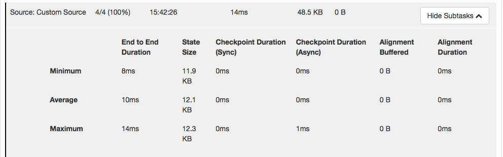

# 概述

操作符将一个或多个数据流转换为新的数据流。程序可以将多个转换组合成复杂的数据流拓扑。

本节描述了基本转换、应用这些转换后的有效物理分区以及对Flink的操作符链接的理解。

## DataStream转换



<table>
  <thead>
    <tr>
      <th style="text-align:left">转换</th>
      <th style="text-align:left">描述</th>
    </tr>
  </thead>
  <tbody>
    <tr>
      <td style="text-align:left"><b>Map</b>
        <br />DataStream → DataStream</td>
      <td style="text-align:left">
        <p>取一个元素并生成一个元素。一个map函数，使输入流的值加倍:</p>
        <p><code>DataStream dataStream = //... </code>
        </p>
        <p><code>dataStream.map(new MapFunction() { </code>
        </p>
        <p><code>    @Override </code>
        </p>
        <p><code>    public Integer map(Integer value) throws Exception {</code>
        </p>
        <p><code>         return 2 * value; </code>
        </p>
        <p><code>     } </code>
        </p>
        <p><code>});</code>
        </p>
      </td>
    </tr>
    <tr>
      <td style="text-align:left"><b>FlatMap</b>
        <br />DataStream → DataStream</td>
      <td style="text-align:left">
        <p>取一个元素并生成0个、1个或多个元素。一个flatMap函数，将句子分割成单词:</p>
        <p><code>dataStream.flatMap(new FlatMapFunction() { </code>
        </p>
        <p><code>    @Override public void flatMap(String value, Collector out) throws Exception { </code>
        </p>
        <p><code>        for(String word: value.split(&quot; &quot;)){ </code>
        </p>
        <p><code>            out.collect(word); </code>
        </p>
        <p><code>        } </code>
        </p>
        <p><code>    } </code>
        </p>
        <p><code>});</code>
        </p>
      </td>
    </tr>
    <tr>
      <td style="text-align:left"><b>Filter</b>
        <br />DataStream → DataStream</td>
      <td style="text-align:left">
        <p>为每个元素计算布尔函数，并保留该函数返回true的元素。过滤掉零值的过滤器:</p>
        <p><code>dataStream.filter(new FilterFunction() { </code>
        </p>
        <p><code>    @Override public boolean filter(Integer value) throws Exception { </code>
        </p>
        <p><code>        return value != 0; </code>
        </p>
        <p><code>    } </code>
        </p>
        <p><code>});</code>
        </p>
      </td>
    </tr>
    <tr>
      <td style="text-align:left"><b>KeyBy</b>
        <br />DataStream → KeyedStream</td>
      <td style="text-align:left">
        <p>逻辑上将流分区为不相交的分区。具有相同密钥的所有记录都分配给同一分区。在内部，<em>keyBy（）</em>是使用散列分区实现的。<a href="https://ci.apache.org/projects/flink/flink-docs-master/dev/api_concepts.html#specifying-keys">指定键</a>有多种方法。</p>
        <p>此转换返回<em>KeyedStream</em>，其中包括使用<a href="https://ci.apache.org/projects/flink/flink-docs-master/dev/stream/state/state.html#keyed-state">键控状态</a>所需的<em>KeyedStream</em>。</p>
        <p><code>dataStream.keyBy(&quot;someKey&quot;) // Key by field &quot;someKey&quot; </code>
        </p>
        <p><code>dataStream.keyBy(0) // Key by the first element of a Tuple</code>
        </p>
        <p>注意：</p>
        <p>如果出现以下情况，则类型<b>不能成为Key</b>：</p>
        <ol>
          <li>POJO类型，但不覆盖<em>hashCode()</em>方法并依赖于<em>Object.hashCode()</em>实现。</li>
          <li>任何类型的数组。</li>
        </ol>
      </td>
    </tr>
    <tr>
      <td style="text-align:left"><b>Reduce</b>
        <br />KeyedStream → DataStream</td>
      <td style="text-align:left">
        <p>键控数据流上的“滚动”减少。将当前元素与最后一个Reduce的值组合并产生新值。</p>
        <p></p>
        <p>reduce函数，用于创建局部和的流：
          <br />
        </p>
        <p><code>keyedStream.reduce(new ReduceFunction&lt;Integer&gt;() {</code>
        </p>
        <p><code>    @Override</code>
        </p>
        <p><code>    public Integer reduce(Integer value1, Integer value2)</code>
        </p>
        <p><code>    throws Exception {</code>
        </p>
        <p><code>        return value1 + value2;</code>
        </p>
        <p><code>    }</code>
        </p>
        <p><code>});</code>
        </p>
      </td>
    </tr>
    <tr>
      <td style="text-align:left"><b>Fold</b>
        <br />KeyedStream → DataStream</td>
      <td style="text-align:left">
        <p>具有初始值的键控数据流上的“滚动”折叠。将当前元素与最后折叠的值组合并生成新值。
          <br />
          <br />
        </p>
        <p>折叠函数，当应用于序列（1,2,3,4,5）时，发出序列“start-1”，“start-1-2”，“start-1-2-3”,. ..</p>
        <p></p>
        <p><code>DataStream&lt;String&gt; result =</code>
        </p>
        <p><code>  keyedStream.fold(&quot;start&quot;, new FoldFunction&lt;Integer, String&gt;() {</code>
        </p>
        <p><code>    @Override</code>
        </p>
        <p><code>    public String fold(String current, Integer value) {</code>
        </p>
        <p><code>        return current + &quot;-&quot; + value;</code>
        </p>
        <p><code>    }</code>
        </p>
        <p><code>  });</code>
        </p>
      </td>
    </tr>
    <tr>
      <td style="text-align:left"><b>Aggregations</b>
        <br />KeyedStream → DataStream</td>
      <td style="text-align:left">
        <p>滚动聚合数据流上的聚合。min和minBy之间的差异是min返回最小值，而minBy返回该字段中具有最小值的元素（max和maxBy相同）。</p>
        <p></p>
        <p><code>keyedStream.sum(0);</code>
        </p>
        <p><code>keyedStream.sum(&quot;key&quot;);</code>
        </p>
        <p><code>keyedStream.min(0);</code>
        </p>
        <p><code>keyedStream.min(&quot;key&quot;);</code>
        </p>
        <p><code>keyedStream.max(0);</code>
        </p>
        <p><code>keyedStream.max(&quot;key&quot;);</code>
        </p>
        <p><code>keyedStream.minBy(0);</code>
        </p>
        <p><code>keyedStream.minBy(&quot;key&quot;);</code>
        </p>
        <p><code>keyedStream.maxBy(0);</code>
        </p>
        <p><code>keyedStream.maxBy(&quot;key&quot;);</code>
        </p>
      </td>
    </tr>
    <tr>
      <td style="text-align:left"><b>Window</b>
        <br />KeyedStream → WindowedStream</td>
      <td style="text-align:left">
        <p>可以在已经分区的KeyedStream上定义Windows。Windows根据某些特征（例如，在最后5秒内到达的数据）对每个密钥中的数据进行分组。有关
          <a
          href="https://ci.apache.org/projects/flink/flink-docs-master/dev/stream/operators/windows.html">窗口</a>的完整说明，请参见windows。</p>
        <p></p>
        <p><code>dataStream.keyBy(0).window(TumblingEventTimeWindows.of(Time.seconds(5))); // Last 5 seconds of data</code>
        </p>
      </td>
    </tr>
    <tr>
      <td style="text-align:left"><b>WindowAll</b>
        <br />DataStream → AllWindowedStream</td>
      <td style="text-align:left">
        <p>Windows可以在常规DataStream上定义。Windows根据某些特征（例如，在最后5秒内到达的数据）对所有流事件进行分组。有关
          <a
          href="https://ci.apache.org/projects/flink/flink-docs-master/dev/stream/operators/windows.html">窗口</a>的完整说明，请参见windows。</p>
        <p><b>警告：</b>在许多情况下，这<b>是非并行</b>转换。所有记录将收集在windowAll操作符的一个任务中。
          <br />
        </p>
        <p><code>dataStream.windowAll(TumblingEventTimeWindows.of(Time.seconds(5))); // Last 5 seconds of data</code>
        </p>
      </td>
    </tr>
    <tr>
      <td style="text-align:left"><b>Window Apply</b>
        <br />WindowedStream → DataStream
        <br />AllWindowedStream → DataStream</td>
      <td style="text-align:left">
        <p>将一般函数应用于整个窗口。下面是一个手动求和窗口元素的函数。</p>
        <p><b>注意：</b>如果您正在使用windowAll转换，则需要使用AllWindowFunction。
          <br />
        </p>
        <p><code>windowedStream.apply (new WindowFunction&lt;Tuple2&lt;String,Integer&gt;, Integer, Tuple, Window&gt;() {</code>
        </p>
        <p><code>    public void apply (Tuple tuple,</code>
        </p>
        <p><code>            Window window,</code>
        </p>
        <p><code>            Iterable&lt;Tuple2&lt;String, Integer&gt;&gt; values,</code>
        </p>
        <p><code>            Collector&lt;Integer&gt; out) throws Exception {</code>
        </p>
        <p><code>        int sum = 0;</code>
        </p>
        <p><code>        for (value t: values) {</code>
        </p>
        <p><code>            sum += t.f1;</code>
        </p>
        <p><code>        }</code>
        </p>
        <p><code>        out.collect (new Integer(sum));</code>
        </p>
        <p><code>    }</code>
        </p>
        <p><code>});</code>
        </p>
        <p><code>// applying an AllWindowFunction on non-keyed window stream</code>
        </p>
        <p><code>allWindowedStream.apply (new AllWindowFunction&lt;Tuple2&lt;String,Integer&gt;, Integer, Window&gt;() {</code>
        </p>
        <p><code>    public void apply (Window window,</code>
        </p>
        <p><code>            Iterable&lt;Tuple2&lt;String, Integer&gt;&gt; values,</code>
        </p>
        <p><code>            Collector&lt;Integer&gt; out) throws Exception {</code>
        </p>
        <p><code>        int sum = 0;</code>
        </p>
        <p><code>        for (value t: values) {</code>
        </p>
        <p><code>            sum += t.f1;</code>
        </p>
        <p><code>        }</code>
        </p>
        <p><code>        out.collect (new Integer(sum));</code>
        </p>
        <p><code>    }</code>
        </p>
        <p><code>});</code>
        </p>
      </td>
    </tr>
    <tr>
      <td style="text-align:left"><b>Window Reduce</b>
        <br />WindowedStream → DataStream</td>
      <td style="text-align:left">
        <p>将ReduceFunction应用于窗口并返回Reduce的值。
          <br />
        </p>
        <p><code>windowedStream.reduce (new ReduceFunction&lt;Tuple2&lt;String,Integer&gt;&gt;() {</code>
        </p>
        <p><code>    public Tuple2&lt;String, Integer&gt; reduce(Tuple2&lt;String, Integer&gt; value1, Tuple2&lt;String, Integer&gt; value2) throws Exception {</code>
        </p>
        <p><code>        return new Tuple2&lt;String,Integer&gt;(value1.f0, value1.f1 + value2.f1);</code>
        </p>
        <p><code>    }</code>
        </p>
        <p><code>});</code>
        </p>
      </td>
    </tr>
    <tr>
      <td style="text-align:left"><b>Window Fold</b>
        <br />WindowedStream → DataStream</td>
      <td style="text-align:left">
        <p>将FoldFunction应用于窗口并返回折叠值。示例函数应用于序列（1,2,3,4,5）时，将序列折叠为字符串“start-1-2-3-4-5”：
          <br
          />
        </p>
        <p><code>windowedStream.fold(&quot;start&quot;, new FoldFunction&lt;Integer, String&gt;() {</code>
        </p>
        <p><code>    public String fold(String current, Integer value) {</code>
        </p>
        <p><code>        return current + &quot;-&quot; + value;</code>
        </p>
        <p><code>    }</code>
        </p>
        <p><code>});</code>
        </p>
      </td>
    </tr>
    <tr>
      <td style="text-align:left"><b>Aggregations on windows</b>
        <br />WindowedStream → DataStream</td>
      <td style="text-align:left">
        <p>聚合窗口的内容。min和minBy之间的差异是min返回最小值，而minBy返回该字段中具有最小值的元素（max和maxBy相同）。
          <br
          />
        </p>
        <p><code>windowedStream.sum(0);</code>
        </p>
        <p><code>windowedStream.sum(&quot;key&quot;);</code>
        </p>
        <p><code>windowedStream.min(0);</code>
        </p>
        <p><code>windowedStream.min(&quot;key&quot;);</code>
        </p>
        <p><code>windowedStream.max(0);</code>
        </p>
        <p><code>windowedStream.max(&quot;key&quot;);</code>
        </p>
        <p><code>windowedStream.minBy(0);</code>
        </p>
        <p><code>windowedStream.minBy(&quot;key&quot;);</code>
        </p>
        <p><code>windowedStream.maxBy(0);</code>
        </p>
        <p><code>windowedStream.maxBy(&quot;key&quot;);</code>
        </p>
      </td>
    </tr>
    <tr>
      <td style="text-align:left"><b>Union</b>
        <br />DataStream* → DataStream</td>
      <td style="text-align:left">
        <p>两个或多个数据流的联合，创建包含来自所有流的所有元素的新流。注意：如果将数据流与其自身联合，则会在结果流中获取两次元素。
          <br />
        </p>
        <p><code>dataStream.union(otherStream1, otherStream2, ...);</code>
        </p>
      </td>
    </tr>
    <tr>
      <td style="text-align:left"><b>Window Join</b>
        <br />DataStream,DataStream → DataStream</td>
      <td style="text-align:left">
        <p>给定密钥和公共窗口上关联两个数据流。
          <br />
        </p>
        <p><code>dataStream.join(otherStream)</code>
        </p>
        <p><code>    .where(&lt;key selector&gt;).equalTo(&lt;key selector&gt;)</code>
        </p>
        <p><code>    .window(TumblingEventTimeWindows.of(Time.seconds(3)))</code>
        </p>
        <p><code>    .apply (new JoinFunction () {...});</code>
        </p>
      </td>
    </tr>
    <tr>
      <td style="text-align:left"><b>Interval Join</b>
        <br />KeyedStream,KeyedStream → DataStream</td>
      <td style="text-align:left">
        <p>在给定的时间间隔内使用公共密钥连接两个键控流的两个元素e1和e2，从而得到e1.timestamp + lowerBound
          <=e 2.timestamp
          <=e 1.timestamp + upperBound</p>
            <p></p>
            <p><code>// this will join the two streams so that</code>
            </p>
            <p><code>// key1 == key2 &amp;&amp; leftTs - 2 &lt; rightTs &lt; leftTs + 2</code>
            </p>
            <p><code>keyedStream.intervalJoin(otherKeyedStream)</code>
            </p>
            <p><code>    .between(Time.milliseconds(-2), Time.milliseconds(2)) // lower and upper bound</code>
            </p>
            <p><code>    .upperBoundExclusive(true) // optional</code>
            </p>
            <p><code>    .lowerBoundExclusive(true) // optional</code>
            </p>
            <p><code>    .process(new IntervalJoinFunction() {...});</code>
            </p>
      </td>
    </tr>
    <tr>
      <td style="text-align:left"><b>Window CoGroup</b>
        <br />DataStream,DataStream → DataStream</td>
      <td style="text-align:left">
        <p>在给定Key和公共窗口上对两个数据流进行Cogroup。
          <br />
        </p>
        <p><code>dataStream.coGroup(otherStream)</code>
        </p>
        <p><code>    .where(0).equalTo(1)</code>
        </p>
        <p><code>    .window(TumblingEventTimeWindows.of(Time.seconds(3)))</code>
        </p>
        <p><code>    .apply (new CoGroupFunction () {...});</code>
        </p>
      </td>
    </tr>
    <tr>
      <td style="text-align:left"><b>Connect</b>
        <br />DataStream,DataStream → ConnectedStreams</td>
      <td style="text-align:left">
        <p>“连接”两个保留类型的数据流。连接允许在两个流之间共享状态。
          <br />
        </p>
        <p><code>DataStream&lt;Integer&gt; someStream = //...</code>
        </p>
        <p><code>DataStream&lt;String&gt; otherStream = //...</code>
        </p>
        <p><code>ConnectedStreams&lt;Integer, String&gt; connectedStreams = someStream.connect(otherStream);</code>
        </p>
      </td>
    </tr>
    <tr>
      <td style="text-align:left"><b>CoMap, CoFlatMap</b>
        <br />ConnectedStreams → DataStream</td>
      <td style="text-align:left">
        <p>类似于连接数据流上的map和flatMap
          <br />
        </p>
        <p><code>connectedStreams.map(new CoMapFunction&lt;Integer, String, Boolean&gt;() {</code>
        </p>
        <p><code>    @Override</code>
        </p>
        <p><code>    public Boolean map1(Integer value) {</code>
        </p>
        <p><code>        return true;</code>
        </p>
        <p><code>    }</code>
        </p>
        <p><code>    @Override</code>
        </p>
        <p><code>    public Boolean map2(String value) {</code>
        </p>
        <p><code>        return false;</code>
        </p>
        <p><code>    }</code>
        </p>
        <p><code>});</code>
        </p>
        <p><code>connectedStreams.flatMap(new CoFlatMapFunction&lt;Integer, String, String&gt;() {</code>
        </p>
        <p><code>   @Override</code>
        </p>
        <p><code>   public void flatMap1(Integer value, Collector&lt;String&gt; out) {</code>
        </p>
        <p><code>       out.collect(value.toString());</code>
        </p>
        <p><code>   }</code>
        </p>
        <p><code>   @Override</code>
        </p>
        <p><code>   public void flatMap2(String value, Collector&lt;String&gt; out) {</code>
        </p>
        <p><code>       for (String word: value.split(&quot; &quot;)) {</code>
        </p>
        <p><code>         out.collect(word);</code>
        </p>
        <p><code>       }</code>
        </p>
        <p><code>   }</code>
        </p>
        <p><code>});</code>
        </p>
      </td>
    </tr>
    <tr>
      <td style="text-align:left"><b>Split</b>
        <br />DataStream → SplitStream</td>
      <td style="text-align:left">
        <p>根据某些标准将流拆分为两个或更多个流。
          <br />
        </p>
        <p><code>SplitStream&lt;Integer&gt; split = someDataStream.split(new OutputSelector&lt;Integer&gt;() {</code>
        </p>
        <p><code>    @Override</code>
        </p>
        <p><code>    public Iterable&lt;String&gt; select(Integer value) {</code>
        </p>
        <p><code>        List&lt;String&gt; output = new ArrayList&lt;String&gt;();</code>
        </p>
        <p><code>        if (value % 2 == 0) {</code>
        </p>
        <p><code>            output.add(&quot;even&quot;);</code>
        </p>
        <p><code>        }</code>
        </p>
        <p><code>        else {</code>
        </p>
        <p><code>            output.add(&quot;odd&quot;);</code>
        </p>
        <p><code>        }</code>
        </p>
        <p><code>        return output;</code>
        </p>
        <p><code>    }</code>
        </p>
        <p><code>});</code>
        </p>
      </td>
    </tr>
    <tr>
      <td style="text-align:left"><b>Select</b>
        <br />SplitStream → DataStream</td>
      <td style="text-align:left">
        <p>从拆分流中选择一个或多个流。
          <br />
        </p>
        <p><code>SplitStream&lt;Integer&gt; split;</code>
        </p>
        <p><code>DataStream&lt;Integer&gt; even = split.select(&quot;even&quot;);</code>
        </p>
        <p><code>DataStream&lt;Integer&gt; odd = split.select(&quot;odd&quot;);</code>
        </p>
        <p><code>DataStream&lt;Integer&gt; all = split.select(&quot;even&quot;,&quot;odd&quot;);</code>
        </p>
      </td>
    </tr>
    <tr>
      <td style="text-align:left"><b>Iterate</b>
        <br />DataStream → IterativeStream → DataStream</td>
      <td style="text-align:left">
        <p>通过将一个操作符的输出重定向到某个先前的操作符，在流中创建“反馈”循环。这对于定义不断更新模型的算法特别有用。以下代码以流开头并连续应用迭代体。大于0的元素将被发送回反馈通道，其余元素将向下游转发。有关完整说明，请参阅
          <a
          href="https://ci.apache.org/projects/flink/flink-docs-master/dev/stream/operators/#iterations">迭代</a>。
            <br />
        </p>
        <p><code>IterativeStream&lt;Long&gt; iteration = initialStream.iterate();</code>
        </p>
        <p><code>DataStream&lt;Long&gt; iterationBody = iteration.map (/*do something*/);</code>
        </p>
        <p><code>DataStream&lt;Long&gt; feedback = iterationBody.filter(new FilterFunction&lt;Long&gt;(){</code>
        </p>
        <p><code>    @Override</code>
        </p>
        <p><code>    public boolean filter(Long value) throws Exception {</code>
        </p>
        <p><code>        return value &gt; 0;</code>
        </p>
        <p><code>    }</code>
        </p>
        <p><code>});</code>
        </p>
        <p><code>iteration.closeWith(feedback);</code>
        </p>
        <p><code>DataStream&lt;Long&gt; output = iterationBody.filter(new FilterFunction&lt;Long&gt;(){</code>
        </p>
        <p><code>    @Override</code>
        </p>
        <p><code>    public boolean filter(Long value) throws Exception {</code>
        </p>
        <p><code>        return value &lt;= 0;</code>
        </p>
        <p><code>    }</code>
        </p>
        <p><code>});</code>
        </p>
      </td>
    </tr>
    <tr>
      <td style="text-align:left"><b>Extract Timestamps</b>
        <br />DataStream → DataStream</td>
      <td style="text-align:left">
        <p>从记录中提取时间戳，以便在使用事件时间语义的窗口时使用。查看<a href="https://ci.apache.org/projects/flink/flink-docs-master/dev/event_time.html">事件时间</a>。
          <br
          />
        </p>
        <p><code>stream.assignTimestamps (new TimeStampExtractor() {...});</code>
        </p>
      </td>
    </tr>
  </tbody>
</table>



<table>
  <thead>
    <tr>
      <th style="text-align:left">转换</th>
      <th style="text-align:left">描述</th>
    </tr>
  </thead>
  <tbody>
    <tr>
      <td style="text-align:left"><b>Map</b>
        <br />DataStream → DataStream</td>
      <td style="text-align:left">
        <p>取一个元素并生成一个元素。一个map函数，使输入流的值加倍:</p>
        <p></p>
        <p><code>dataStream.map { x =&gt; x * 2 }</code>
        </p>
      </td>
    </tr>
    <tr>
      <td style="text-align:left"><b>FlatMap</b>
        <br />DataStream → DataStream</td>
      <td style="text-align:left">
        <p>取一个元素并生成0个、1个或多个元素。一个flatMap函数，将句子分割成单词:</p>
        <p></p>
        <p><code>dataStream.flatMap { str =&gt; str.split(&quot; &quot;) }</code>
        </p>
      </td>
    </tr>
    <tr>
      <td style="text-align:left"><b>Filter</b>
        <br />DataStream → DataStream</td>
      <td style="text-align:left">
        <p>为每个元素计算布尔函数，并保留该函数返回true的元素。过滤掉零值的过滤器:
          <br />
        </p>
        <p><code>dataStream.filter { _ != 0 }</code>
        </p>
      </td>
    </tr>
    <tr>
      <td style="text-align:left"><b>KeyBy</b>
        <br />DataStream → KeyedStream</td>
      <td style="text-align:left">
        <p>逻辑上将流分区为不相交的分区。具有相同密钥的所有记录都分配给同一分区。在内部，<em>keyBy（）</em>是使用散列分区实现的。<a href="https://ci.apache.org/projects/flink/flink-docs-master/dev/api_concepts.html#specifying-keys">指定键</a>有多种方法。</p>
        <p>此转换返回<em>KeyedStream</em>，其中包括使用<a href="https://ci.apache.org/projects/flink/flink-docs-master/dev/stream/state/state.html#keyed-state">键控状态</a>所需的<em>KeyedStream</em>。</p>
        <p><code>dataStream.keyBy(&quot;someKey&quot;) // Key by field &quot;someKey&quot; </code>
        </p>
        <p><code>dataStream.keyBy(0) // Key by the first element of a Tuple</code>
        </p>
        <p>注意：</p>
        <p>如果出现以下情况，则类型<b>不能成为Key</b>：</p>
        <ol>
          <li>POJO类型，但不覆盖<em>hashCode()</em>方法并依赖于<em>Object.hashCode()</em>实现。</li>
          <li>任何类型的数组。</li>
        </ol>
      </td>
    </tr>
    <tr>
      <td style="text-align:left"><b>Reduce</b>
        <br />KeyedStream → DataStream</td>
      <td style="text-align:left">
        <p>键控数据流上的“滚动”减少。将当前元素与最后一个Reduce的值组合并产生新值。</p>
        <p></p>
        <p>reduce函数，用于创建局部和的流：
          <br />
        </p>
        <p><code>keyedStream.reduce { _ + _ }</code>
        </p>
      </td>
    </tr>
    <tr>
      <td style="text-align:left"><b>Fold</b>
        <br />KeyedStream → DataStream</td>
      <td style="text-align:left">
        <p>具有初始值的键控数据流上的“滚动”折叠。将当前元素与最后折叠的值组合并生成新值。
          <br />
          <br />
        </p>
        <p>折叠函数，当应用于序列（1,2,3,4,5）时，发出序列“start-1”，“start-1-2”，“start-1-2-3”,. ..</p>
        <p></p>
        <p><code>val result: DataStream[String] =</code>
        </p>
        <p><code>    keyedStream.fold(&quot;start&quot;)((str, i) =&gt; { str + &quot;-&quot; + i })</code>
        </p>
      </td>
    </tr>
    <tr>
      <td style="text-align:left"><b>Aggregations</b>
        <br />KeyedStream → DataStream</td>
      <td style="text-align:left">
        <p>滚动聚合数据流上的聚合。min和minBy之间的差异是min返回最小值，而minBy返回该字段中具有最小值的元素（max和maxBy相同）。</p>
        <p></p>
        <p><code>keyedStream.sum(0);</code>
        </p>
        <p><code>keyedStream.sum(&quot;key&quot;);</code>
        </p>
        <p><code>keyedStream.min(0);</code>
        </p>
        <p><code>keyedStream.min(&quot;key&quot;);</code>
        </p>
        <p><code>keyedStream.max(0);</code>
        </p>
        <p><code>keyedStream.max(&quot;key&quot;);</code>
        </p>
        <p><code>keyedStream.minBy(0);</code>
        </p>
        <p><code>keyedStream.minBy(&quot;key&quot;);</code>
        </p>
        <p><code>keyedStream.maxBy(0);</code>
        </p>
        <p><code>keyedStream.maxBy(&quot;key&quot;);</code>
        </p>
      </td>
    </tr>
    <tr>
      <td style="text-align:left"><b>Window</b>
        <br />KeyedStream → WindowedStream</td>
      <td style="text-align:left">
        <p>可以在已经分区的KeyedStream上定义Windows。Windows根据某些特征（例如，在最后5秒内到达的数据）对每个密钥中的数据进行分组。有关
          <a
          href="https://ci.apache.org/projects/flink/flink-docs-master/dev/stream/operators/windows.html">窗口</a>的完整说明，请参见windows。</p>
        <p></p>
        <p><code>dataStream.keyBy(0).window(TumblingEventTimeWindows.of(Time.seconds(5))); // Last 5 seconds of data</code>
        </p>
      </td>
    </tr>
    <tr>
      <td style="text-align:left"><b>WindowAll</b>
        <br />DataStream → AllWindowedStream</td>
      <td style="text-align:left">
        <p>Windows可以在常规DataStream上定义。Windows根据某些特征（例如，在最后5秒内到达的数据）对所有流事件进行分组。有关
          <a
          href="https://ci.apache.org/projects/flink/flink-docs-master/dev/stream/operators/windows.html">窗口</a>的完整说明，请参见windows。</p>
        <p><b>警告：</b>在许多情况下，这<b>是非并行</b>转换。所有记录将收集在windowAll操作符的一个任务中。
          <br />
        </p>
        <p><code>dataStream.windowAll(TumblingEventTimeWindows.of(Time.seconds(5))); // Last 5 seconds of data</code>
        </p>
      </td>
    </tr>
    <tr>
      <td style="text-align:left"><b>Window Apply</b>
        <br />WindowedStream → DataStream
        <br />AllWindowedStream → DataStream</td>
      <td style="text-align:left">
        <p>将一般函数应用于整个窗口。下面是一个手动求和窗口元素的函数。</p>
        <p><b>注意：</b>如果您正在使用windowAll转换，则需要使用AllWindowFunction。
          <br />
        </p>
        <p><code>windowedStream.apply { WindowFunction }</code>
        </p>
        <p><code>// applying an AllWindowFunction on non-keyed window stream</code>
        </p>
        <p><code>allWindowedStream.apply { AllWindowFunction }</code>
        </p>
      </td>
    </tr>
    <tr>
      <td style="text-align:left"><b>Window Reduce</b>
        <br />WindowedStream → DataStream</td>
      <td style="text-align:left">
        <p>将ReduceFunction应用于窗口并返回Reduce的值。</p>
        <p></p>
        <p><code>windowedStream.reduce { _ + _ }</code>
        </p>
      </td>
    </tr>
    <tr>
      <td style="text-align:left"><b>Window Fold</b>
        <br />WindowedStream → DataStream</td>
      <td style="text-align:left">
        <p>将FoldFunction应用于窗口并返回折叠值。示例函数应用于序列（1,2,3,4,5）时，将序列折叠为字符串“start-1-2-3-4-5”：
          <br
          />
        </p>
        <p><code>val result: DataStream[String] =</code>
        </p>
        <p><code>    windowedStream.fold(&quot;start&quot;, (str, i) =&gt; { str + &quot;-&quot; + i })</code>
        </p>
      </td>
    </tr>
    <tr>
      <td style="text-align:left"><b>Aggregations on windows</b>
        <br />WindowedStream → DataStream</td>
      <td style="text-align:left">
        <p>聚合窗口的内容。min和minBy之间的差异是min返回最小值，而minBy返回该字段中具有最小值的元素（max和maxBy相同）。
          <br
          />
        </p>
        <p><code>windowedStream.sum(0);</code>
        </p>
        <p><code>windowedStream.sum(&quot;key&quot;);</code>
        </p>
        <p><code>windowedStream.min(0);</code>
        </p>
        <p><code>windowedStream.min(&quot;key&quot;);</code>
        </p>
        <p><code>windowedStream.max(0);</code>
        </p>
        <p><code>windowedStream.max(&quot;key&quot;);</code>
        </p>
        <p><code>windowedStream.minBy(0);</code>
        </p>
        <p><code>windowedStream.minBy(&quot;key&quot;);</code>
        </p>
        <p><code>windowedStream.maxBy(0);</code>
        </p>
        <p><code>windowedStream.maxBy(&quot;key&quot;);</code>
        </p>
      </td>
    </tr>
    <tr>
      <td style="text-align:left"><b>Union</b>
        <br />DataStream* → DataStream</td>
      <td style="text-align:left">
        <p>两个或多个数据流的联合，创建包含来自所有流的所有元素的新流。注意：如果将数据流与其自身联合，则会在结果流中获取两次元素。
          <br />
        </p>
        <p><code>dataStream.union(otherStream1, otherStream2, ...);</code>
        </p>
      </td>
    </tr>
    <tr>
      <td style="text-align:left"><b>Window Join</b>
        <br />DataStream,DataStream → DataStream</td>
      <td style="text-align:left">
        <p>给定密钥和公共窗口上关联两个数据流。
          <br />
        </p>
        <p><code>dataStream.join(otherStream)</code>
        </p>
        <p><code>    .where(&lt;key selector&gt;).equalTo(&lt;key selector&gt;)</code>
        </p>
        <p><code>    .window(TumblingEventTimeWindows.of(Time.seconds(3)))</code>
        </p>
        <p><code>    .apply { ... }</code>
        </p>
      </td>
    </tr>
    <tr>
      <td style="text-align:left"><b>Window CoGroup</b>
        <br />DataStream,DataStream → DataStream</td>
      <td style="text-align:left">
        <p>在给定Key和公共窗口上对两个数据流进行Cogroup。
          <br />
        </p>
        <p><code>dataStream.coGroup(otherStream)</code>
        </p>
        <p><code>    .where(0).equalTo(1)</code>
        </p>
        <p><code>    .window(TumblingEventTimeWindows.of(Time.seconds(3)))</code>
        </p>
        <p><code>    .apply {}</code>
        </p>
      </td>
    </tr>
    <tr>
      <td style="text-align:left"><b>Connect</b>
        <br />DataStream,DataStream → ConnectedStreams</td>
      <td style="text-align:left">
        <p>“连接”两个保留类型的数据流。连接允许在两个流之间共享状态。
          <br />
        </p>
        <p><code>someStream : DataStream[Int] = ...</code>
        </p>
        <p><code>otherStream : DataStream[String] = ...</code>
        </p>
        <p><code>val connectedStreams = someStream.connect(otherStream)</code>
        </p>
      </td>
    </tr>
    <tr>
      <td style="text-align:left"><b>CoMap, CoFlatMap</b>
        <br />ConnectedStreams → DataStream</td>
      <td style="text-align:left">
        <p>类似于连接数据流上的map和flatMap
          <br />
        </p>
        <p><code>connectedStreams.map(</code>
        </p>
        <p><code>    (_ : Int) =&gt; true,</code>
        </p>
        <p><code>    (_ : String) =&gt; false</code>
        </p>
        <p><code>)</code>
        </p>
        <p><code>connectedStreams.flatMap(</code>
        </p>
        <p><code>    (_ : Int) =&gt; true,</code>
        </p>
        <p><code>    (_ : String) =&gt; false</code>
        </p>
        <p><code>)</code>
        </p>
      </td>
    </tr>
    <tr>
      <td style="text-align:left"><b>Split</b>
        <br />DataStream → SplitStream</td>
      <td style="text-align:left">
        <p>根据某些标准将流拆分为两个或更多个流。
          <br />
        </p>
        <p><code>val split = someDataStream.split(</code>
        </p>
        <p><code>  (num: Int) =&gt;</code>
        </p>
        <p><code>    (num % 2) match {</code>
        </p>
        <p><code>      case 0 =&gt; List(&quot;even&quot;)</code>
        </p>
        <p><code>      case 1 =&gt; List(&quot;odd&quot;)</code>
        </p>
        <p><code>    }</code>
        </p>
        <p><code>)</code>
        </p>
      </td>
    </tr>
    <tr>
      <td style="text-align:left"><b>Select</b>
        <br />SplitStream → DataStream</td>
      <td style="text-align:left">
        <p>从拆分流中选择一个或多个流。
          <br />
        </p>
        <p><code>val even = split select &quot;even&quot;</code>
        </p>
        <p><code>val odd = split select &quot;odd&quot;</code>
        </p>
        <p><code>val all = split.select(&quot;even&quot;,&quot;odd&quot;)</code>
        </p>
      </td>
    </tr>
    <tr>
      <td style="text-align:left"><b>Iterate</b>
        <br />DataStream → IterativeStream → DataStream</td>
      <td style="text-align:left">
        <p>通过将一个操作符的输出重定向到某个先前的操作符，在流中创建“反馈”循环。这对于定义不断更新模型的算法特别有用。以下代码以流开头并连续应用迭代体。大于0的元素将被发送回反馈通道，其余元素将向下游转发。有关完整说明，请参阅
          <a
          href="https://ci.apache.org/projects/flink/flink-docs-master/dev/stream/operators/#iterations">迭代</a>。
            <br />
        </p>
        <p><code>initialStream.iterate {</code>
        </p>
        <p><code>  iteration =&gt; {</code>
        </p>
        <p><code>    val iterationBody = iteration.map {/*do something*/}</code>
        </p>
        <p><code>    (iterationBody.filter(_ &gt; 0), iterationBody.filter(_ &lt;= 0))</code>
        </p>
        <p><code>  }</code>
        </p>
        <p><code>}</code>
        </p>
      </td>
    </tr>
    <tr>
      <td style="text-align:left"><b>Extract Timestamps</b>
        <br />DataStream → DataStream</td>
      <td style="text-align:left">
        <p>从记录中提取时间戳，以便在使用事件时间语义的窗口时使用。查看<a href="https://ci.apache.org/projects/flink/flink-docs-master/dev/event_time.html">事件时间</a>。
          <br
          />
        </p>
        <p><code>stream.assignTimestamps { timestampExtractor }</code>
        </p>
      </td>
    </tr>
  </tbody>
</table>通过匿名模式匹配从元组、case类和集合中提取，如下所示:

```scala
val data: DataStream[(Int, String, Double)] = // [...]
data.map {
  case (id, name, temperature) => // [...]
}
```

API不支持开箱即用。要使用此功能，您应该使用[Scala API扩展](https://ci.apache.org/projects/flink/flink-docs-master/dev/scala_api_extensions.html)。



以下转换可用于元组\(Tuple\)的数据流：

<table>
  <thead>
    <tr>
      <th style="text-align:left">转换</th>
      <th style="text-align:left">描述</th>
    </tr>
  </thead>
  <tbody>
    <tr>
      <td style="text-align:left"><b>Project</b>
        <br />DataStream→DataStream</td>
      <td style="text-align:left">
        <p>从元组中选择字段的子集</p>
        <p><code>DataStream&gt; in = // [...] </code>
        </p>
        <p><code>DataStream&gt; out = in.project(2,0);</code>
        </p>
      </td>
    </tr>
  </tbody>
</table>## 物理分区

Flink还通过以下函数对转换后的精确流分区进行低级别控制（如果需要）。

<table>
  <thead>
    <tr>
      <th style="text-align:left">转换</th>
      <th style="text-align:left">描述</th>
    </tr>
  </thead>
  <tbody>
    <tr>
      <td style="text-align:left"><b>自定义分区</b>
        <br />DataStream→DataStream</td>
      <td style="text-align:left">使用用户定义的分区程序为每个元素选择目标任务。
        <br /><code>dataStream.partitionCustom(partitioner, &quot;someKey&quot;); dataStream.partitionCustom(partitioner, 0);</code>
      </td>
    </tr>
    <tr>
      <td style="text-align:left"><b>随机分区</b>
        <br />DataStream→DataStream</td>
      <td style="text-align:left">
        <p>根据均匀分布随机分配元素。</p>
        <p><code>dataStream.shuffle();</code>
        </p>
      </td>
    </tr>
    <tr>
      <td style="text-align:left"><b>重新平衡（循环分区）</b>
        <br />DataStream→DataStream</td>
      <td style="text-align:left">
        <p>循环分区元素，每个分区创建相等的负载。在存在数据偏斜时用于性能优化。</p>
        <p><code>dataStream.rebalance();</code>
        </p>
      </td>
    </tr>
    <tr>
      <td style="text-align:left"><b>重新调整</b>
        <br />DataStream→DataStream</td>
      <td style="text-align:left">
        <p>分区元素，循环，到下游操作的子集。如果您希望拥有管道，例如，从源的每个并行实例向多个映射器的子集展开以分配负载，但又不希望使用rebalance()带来的完全重新平衡，那么这非常有用。这将只需要本地数据传输而不是通过网络传输数据，具体取决于其他配置值，例如TaskManagers的插槽数。</p>
        <p>上游操作发送元素的下游操作的子集取决于上游和下游操作的并行度。例如，如果上游操作具有并行性2并且下游操作具有并行性6，则一个上游操作将分配元素到三个下游操作，而另一个上游操作将分配到其他三个下游操作。另一方面，如果下游操作具有并行性2而上游操作具有并行性6，则三个上游操作将分配到一个下游操作，而其他三个上游操作将分配到另一个下游操作。</p>
        <p>在不同并行度不是彼此的倍数的情况下，一个或多个下游操作将具有来自上游操作的不同数量的输入。</p>
        <p><code>dataStream.rescale();</code>
        </p>
      </td>
    </tr>
    <tr>
      <td style="text-align:left"><b>广播</b>
        <br />DataStream→DataStream</td>
      <td style="text-align:left">
        <p>向每个分区广播元素。</p>
        <p><code>dataStream.broadcast();</code>
        </p>
      </td>
    </tr>
  </tbody>
</table>

## 任务链和资源组 <a id="task-chaining-and-resource-groups"></a>

资源组是Flink中的一个插槽\(Slot\)，请参阅 [插槽](https://ci.apache.org/projects/flink/flink-docs-master/ops/config.html#configuring-taskmanager-processing-slots)。如果需要，您可以在单独的插槽中手动隔离操作符

<table>
  <thead>
    <tr>
      <th style="text-align:left">转换</th>
      <th style="text-align:left">描述</th>
    </tr>
  </thead>
  <tbody>
    <tr>
      <td style="text-align:left">开始新的Chain</td>
      <td style="text-align:left">
        <p>从这个操作符开始，开启一个新的Chain。两个映射器将被链接，</p>
        <p>过滤器将不会链接到第一个映射器。</p>
        <p><code>someStream.filter(...).map(...).startNewChain().map(...);</code>
        </p>
      </td>
    </tr>
    <tr>
      <td style="text-align:left">禁用Chain</td>
      <td style="text-align:left">
        <p>不链接map操作符</p>
        <p><code>someStream.map(...).disableChaining();</code>
        </p>
      </td>
    </tr>
    <tr>
      <td style="text-align:left">设置插槽(Slot)共享组</td>
      <td style="text-align:left">
        <p>设置操作的插槽共享组。Flink将把具有相同插槽共享组的操作放入同一个插槽，</p>
        <p>同时保留其他插槽中没有插槽共享组的操作。这可用于隔离插槽。如果所有</p>
        <p>输入操作都在同一个插槽共享组中，则插槽共享组将继承输入操作。默认</p>
        <p>插槽共享组的名称为“default”，可以通过调用slotSharingGroup（“default”）将操作明确地放入此组中。</p>
        <p><code>someStream.filter(...).slotSharingGroup(&quot;name&quot;);</code>
        </p>
      </td>
    </tr>
  </tbody>
</table>