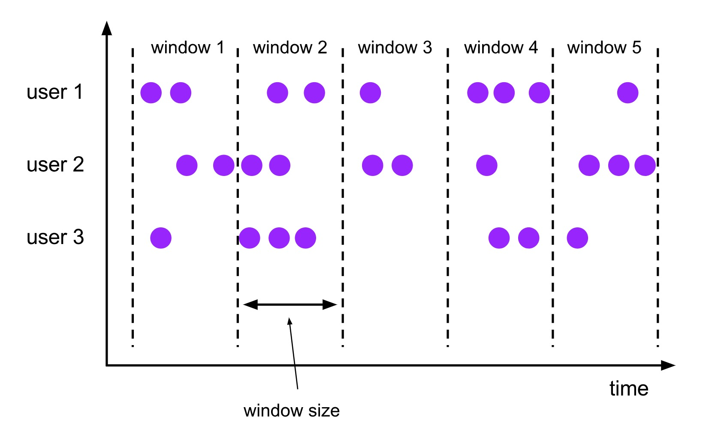
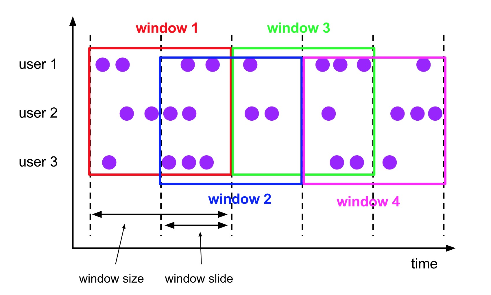
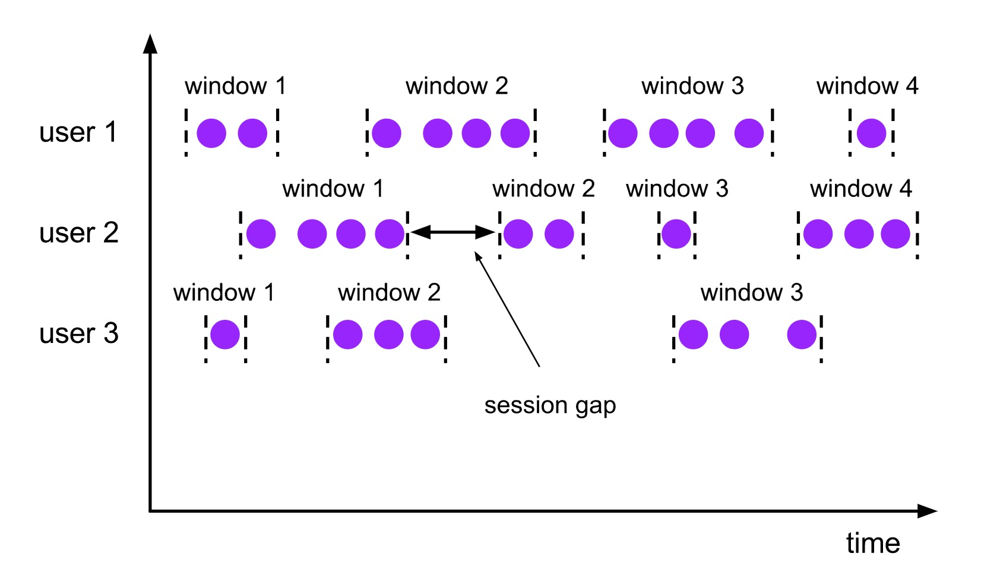
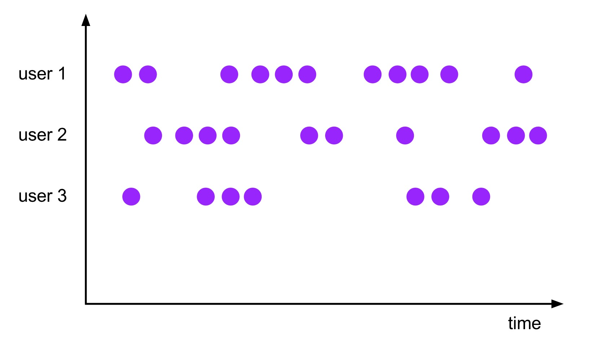

# Windows

Windows是处理无限流的核心。Windows将流拆分为有限大小的“桶”，我们可以在其上应用计算。本文档重点介绍如何在Flink中执行窗口，以及程序员如何从其提供的功能中获益最大化。

Flink窗口程序的总体结构如下所示。第一个片段引用键控流，第二个片段引用非键控流。可以看到，唯一的区别是keyBy\(…\)调用键控流，而window\(…\)变成了windowAll\(…\)调用非键控流。这也将作为本章接下来所要讲述部分的路线图。

**键控窗口**

```text
stream
       .keyBy(...)               <-  keyed versus non-keyed windows
       .window(...)              <-  required: "assigner"
      [.trigger(...)]            <-  optional: "trigger" (else default trigger)
      [.evictor(...)]            <-  optional: "evictor" (else no evictor)
      [.allowedLateness(...)]    <-  optional: "lateness" (else zero)
      [.sideOutputLateData(...)] <-  optional: "output tag" (else no side output for late data)
       .reduce/aggregate/fold/apply()      <-  required: "function"
      [.getSideOutput(...)]      <-  optional: "output tag"
```

**非键控窗口**

```text
stream
       .windowAll(...)           <-  required: "assigner"
      [.trigger(...)]            <-  optional: "trigger" (else default trigger)
      [.evictor(...)]            <-  optional: "evictor" (else no evictor)
      [.allowedLateness(...)]    <-  optional: "lateness" (else zero)
      [.sideOutputLateData(...)] <-  optional: "output tag" (else no side output for late data)
       .reduce/aggregate/fold/apply()      <-  required: "function"
      [.getSideOutput(...)]      <-  optional: "output tag"
```

在上面，方括号（\[...\]）中的命令是可选的。这表明Flink允许您以多种不同方式自定义窗口逻辑，以适合你的需求。

## 窗口生命周期

简而言之，当属于该窗口的第一个元素到达时，就会创建一个窗口，当时间（事件或处理时间）超过其结束时间戳加上用户指定的允许延迟（请参见[允许延迟](https://ci.apache.org/projects/flink/flink-docs-master/dev/stream/operators/windows.html#allowed-lateness)）时，该窗口将被完全删除。Flink保证只删除基于时间的窗口，而不删除其他类型的窗口，例如全局窗口（请参见[窗口分配程序](https://ci.apache.org/projects/flink/flink-docs-master/dev/stream/operators/windows.html#window-assigners)）。例如，使用基于事件时间的窗口策略，每5分钟创建一个不重叠（或翻滚）窗口，允许延迟1分钟，Flink将为`12:00`到`12:05`之间的间隔创建一个新窗口，当第一个时间戳属于此间隔的元素到达时，它将在水位线通过`12:06` 时间戳时将其删除。

此外，每个窗口都有一个触发器\(Trigger\)（参见[触发器](https://ci.apache.org/projects/flink/flink-docs-master/dev/stream/operators/windows.html#triggers)）和一个附加的函数（ProcessWindowFunction，ReduceFunction，AggregateFunction或FoldFunction）（请参阅[窗口函数](https://ci.apache.org/projects/flink/flink-docs-master/dev/stream/operators/windows.html#window-functions)）。 该函数将包含要应用于窗口内容的计算，而触发器指定窗口被认为准备好应用该函数的条件。 触发策略可能类似于“当窗口中的元素数量大于4”时，或“当水位线通过窗口结束时”。 触发器还可以决定在创建和删除之间的任何时间清除窗口的内容。 在这种情况下，清除仅涉及窗口中的元素，而不是窗口元数据。 这意味着仍然可以将新数据添加到该窗口。

除了上述之外，您还可以指定一个Evictor（参见[Evictors](https://ci.apache.org/projects/flink/flink-docs-master/dev/stream/operators/windows.html#evictors)），它可以在触发器触发后以及应用函数之前和/或之后从窗口中删除元素。

在下文中，我们将详细介绍上述每个组件。 我们从上面代码段中的必需部分开始（请参阅[键控与非键控窗口](https://ci.apache.org/projects/flink/flink-docs-master/dev/stream/operators/windows.html#keyed-vs-non-keyed-windows)，[窗口分配器](https://ci.apache.org/projects/flink/flink-docs-master/dev/stream/operators/windows.html#window-assigner)和[窗口函数](https://ci.apache.org/projects/flink/flink-docs-master/dev/stream/operators/windows.html#window-function)），然后再转到可选部分。

## 键控与非键控窗口

要指定的第一件事是是否应该对流进行键控。这必须在定义窗口之前完成。使用keyby\(...\)将无限流拆分为逻辑键控流。如果未调用keyby\(...\)，则不会为流设置Key。

对于键控流，传入事件的任何属性都可以用作键（[此处](https://ci.apache.org/projects/flink/flink-docs-master/dev/api_concepts.html#specifying-keys)提供更多详细信息）。具有键控流将允许多个任务并行执行窗口化计算，因为每个逻辑键控流都可以独立于其他流进行处理。引用同一个键的所有元素都将发送到同一个并行任务。

在非键控流的情况下，原始流不会被分割成多个逻辑流，所有窗口化逻辑将由单个任务执行，即并行度为1。

## 窗口分配器

指定流是否键控之后，下一步是定义一个窗口分配器。窗口分配器定义如何将元素分配给窗口。这是通过`WindowAssigner` 在`window(...)`（对于_键控_流）或`windowAll()`（对于_非键控_流）调用中指定您的选择来完成的。

`WindowAssigner`负责将每个传入元素分配给一个或多个窗口。 Flink带有预定义的窗口分配器，用于最常见的用例，即翻滚窗口，滑动窗口，会话窗口和全局窗口。您还可以通过扩展`WindowAssigner`类来实现自定义窗口分配器。所有内置窗口分配器（全局窗口除外）都根据时间为窗口分配元素，这可以是处理时间或事件时间。请查看关于[事件时间](https://ci.apache.org/projects/flink/flink-docs-master/dev/event_time.html)的部分，了解处理时间和事件时间之间的差异以及时间戳和水位线的生成方式。

基于时间的窗口具有开始时间戳（包括）和结束时间戳（不包括），它们一起描述窗口的大小。在代码中，Flink在使用基于时间的窗口时使用TimeWindow，该窗口具有查询开始和结束时间戳的方法，以及返回给定窗口的最大允许时间戳的附加方法`maxTimestamp()`。

在下文中，我们将展示Flink的预定义窗口分配器如何工作以及如何在DataStream程序中使用它们。下图显示了每个分配者的工作情况。紫色圆圈表示流的元素，这些元素由某个键（在这种情况下是用户1，用户2和用户3）划分。 x轴显示时间的进度。

### 滚动窗口

翻滚窗口分配器将每个元素分配给指定窗口大小的窗口。 翻滚窗具有固定的尺寸，不重叠。 例如，如果指定大小为5分钟的翻滚窗口，则将评估当前窗口，并且每五分钟将启动一个新窗口，如下图所示。



以下代码段展示了如何使用翻滚窗口。



```java
DataStream<T> input = ...;

// tumbling event-time windows
input
    .keyBy(<key selector>)
    .window(TumblingEventTimeWindows.of(Time.seconds(5)))
    .<windowed transformation>(<window function>);

// tumbling processing-time windows
input
    .keyBy(<key selector>)
    .window(TumblingProcessingTimeWindows.of(Time.seconds(5)))
    .<windowed transformation>(<window function>);

// daily tumbling event-time windows offset by -8 hours.
input
    .keyBy(<key selector>)
    .window(TumblingEventTimeWindows.of(Time.days(1), Time.hours(-8)))
    .<windowed transformation>(<window function>);
```



```scala
val input: DataStream[T] = ...

// tumbling event-time windows
input
    .keyBy(<key selector>)
    .window(TumblingEventTimeWindows.of(Time.seconds(5)))
    .<windowed transformation>(<window function>)

// tumbling processing-time windows
input
    .keyBy(<key selector>)
    .window(TumblingProcessingTimeWindows.of(Time.seconds(5)))
    .<windowed transformation>(<window function>)

// daily tumbling event-time windows offset by -8 hours.
input
    .keyBy(<key selector>)
    .window(TumblingEventTimeWindows.of(Time.days(1), Time.hours(-8)))
    .<windowed transformation>(<window function>)
```



时间间隔可以通过`Time.milliseconds(x)`，`Time.seconds(x)`， `Time.minutes(x)`等等指定。

如上一个示例所示，翻滚窗口分配器还采用可选`offset` 参数，可用于更改窗口的对齐方式。例如，如果没有偏移，每小时滚动的窗口将与epoch对齐，也就是说，将获得诸如`1:00:00.000 - 1:59:59.999`，`2:00:00.000 - 2:59:59.999`等窗口。如果你想改变它，你可以给出一个偏移量。例如，如果偏移量为15分钟，您将得到 `1:15:00.000 - 2:14:59.999`，`2:15:00.000 - 3:14:59.999`等。

偏移量的一个重要使用案例是将窗口调整到UTC-0以外的时区。例如，在中国，您必须指定偏移量`Time.hours(-8)`。

### 滑动窗口

滑动窗口分配器将元素分配给固定长度的窗口。 与翻滚窗口分配器类似，窗口大小由窗口大小参数配置。 附加的窗口滑动参数控制滑动窗口的启动频率。 因此，如果幻灯片小于窗口大小，则滑动窗口可以重叠。 在这种情况下，元素被分配给多个窗口。

例如，您可以将大小为10分钟的窗口滑动5分钟。 有了这个，你每隔5分钟就会得到一个窗口，其中包含过去10分钟内到达的事件，如下图所示。



以下代码段展示了如何使用滑动窗口。



```java
DataStream<T> input = ...;

// sliding event-time windows
input
    .keyBy(<key selector>)
    .window(SlidingEventTimeWindows.of(Time.seconds(10), Time.seconds(5)))
    .<windowed transformation>(<window function>);

// sliding processing-time windows
input
    .keyBy(<key selector>)
    .window(SlidingProcessingTimeWindows.of(Time.seconds(10), Time.seconds(5)))
    .<windowed transformation>(<window function>);

// sliding processing-time windows offset by -8 hours
input
    .keyBy(<key selector>)
    .window(SlidingProcessingTimeWindows.of(Time.hours(12), Time.hours(1), Time.hours(-8)))
    .<windowed transformation>(<window function>);
```



```scala
val input: DataStream[T] = ...

// sliding event-time windows
input
    .keyBy(<key selector>)
    .window(SlidingEventTimeWindows.of(Time.seconds(10), Time.seconds(5)))
    .<windowed transformation>(<window function>)

// sliding processing-time windows
input
    .keyBy(<key selector>)
    .window(SlidingProcessingTimeWindows.of(Time.seconds(10), Time.seconds(5)))
    .<windowed transformation>(<window function>)

// sliding processing-time windows offset by -8 hours
input
    .keyBy(<key selector>)
    .window(SlidingProcessingTimeWindows.of(Time.hours(12), Time.hours(1), Time.hours(-8)))
    .<windowed transformation>(<window function>)
```



时间间隔可以通过使用`Time.milliseconds(x)`，`Time.seconds(x)`， `Time.minutes(x)`等来指定。

如上一个示例所示，滑动窗口赋值器还采用可选的偏移参数，该参数可用于更改窗口的对齐方式。例如，如果没有偏移，每小时滑动30分钟的窗口将与epoch对齐，也就是说，您将得到`1:00:00.000-1:59:59.999`、`1:30:00.000-2:29:59.999`等窗口。如果你想改变它，你可以给出一个偏移量。例如，如果偏移量为15分钟，您将得到`1:15:00.000-2:14:59.999`、`1:45:00.000-2:44:59.999`等。偏移量的一个重要使用案例是将窗口调整到UTC-0以外的时区。例如，在中国，您必须指定一个time.hours的偏移量（-8）。

### 会话窗口

会话窗口分配程序按活动会话对元素进行分组。与滚动窗口和滑动窗口相比，会话窗口不重叠，也没有固定的开始和结束时间。相反，当会话窗口在一段时间内不接收元素时（即，当出现不活动间隙时），它将关闭。会话窗口分配程序可以配置为静态会话间隙，也可以配置为会话间隙提取程序函数，该函数定义不活动的时间长度。当这段时间到期时，当前会话将关闭，随后的元素将分配给新的会话窗口。



以下代码段展示了如何使用会话窗口。



```java
DataStream<T> input = ...;

// event-time session windows with static gap
input
    .keyBy(<key selector>)
    .window(EventTimeSessionWindows.withGap(Time.minutes(10)))
    .<windowed transformation>(<window function>);
    
// event-time session windows with dynamic gap
input
    .keyBy(<key selector>)
    .window(EventTimeSessionWindows.withDynamicGap((element) -> {
        // determine and return session gap
    }))
    .<windowed transformation>(<window function>);

// processing-time session windows with static gap
input
    .keyBy(<key selector>)
    .window(ProcessingTimeSessionWindows.withGap(Time.minutes(10)))
    .<windowed transformation>(<window function>);
    
// processing-time session windows with dynamic gap
input
    .keyBy(<key selector>)
    .window(ProcessingTimeSessionWindows.withDynamicGap((element) -> {
        // determine and return session gap
    }))
    .<windowed transformation>(<window function>);
```



```scala
val input: DataStream[T] = ...

// event-time session windows with static gap
input
    .keyBy(<key selector>)
    .window(EventTimeSessionWindows.withGap(Time.minutes(10)))
    .<windowed transformation>(<window function>)

// event-time session windows with dynamic gap
input
    .keyBy(<key selector>)
    .window(EventTimeSessionWindows.withDynamicGap(new SessionWindowTimeGapExtractor[String] {
      override def extract(element: String): Long = {
        // determine and return session gap
      }
    }))
    .<windowed transformation>(<window function>)

// processing-time session windows with static gap
input
    .keyBy(<key selector>)
    .window(ProcessingTimeSessionWindows.withGap(Time.minutes(10)))
    .<windowed transformation>(<window function>)


// processing-time session windows with dynamic gap
input
    .keyBy(<key selector>)
    .window(DynamicProcessingTimeSessionWindows.withDynamicGap(new SessionWindowTimeGapExtractor[String] {
      override def extract(element: String): Long = {
        // determine and return session gap
      }
    }))
    .<windowed transformation>(<window function>)
```



静态间隙可以通过使用`Time.milliseconds(x)`，`Time.seconds(x)`， `Time.minutes(x)`等来指定。

通过实现`SessionWindowTimeGapExtractor`接口指定动态间隙。


由于会话窗口没有固定的开始和结束，因此它们的评估方式与翻滚和滑动窗口不同。在内部，会话窗口操作员为每个到达的记录创建一个新窗口，如果它们彼此之间的距离比定义的间隙更接近，则将窗口合并在一起。为了可合并的，会话窗口操作者需要一个合并[触发器](https://ci.apache.org/projects/flink/flink-docs-release-1.7/dev/stream/operators/windows.html#triggers)和一个合并的[窗口函数](https://ci.apache.org/projects/flink/flink-docs-release-1.7/dev/stream/operators/windows.html#window-functions)，如`ReduceFunction`，`AggregateFunction`，或`ProcessWindowFunction` （`FoldFunction`不能合并。）


### 全局窗口

全局窗口分配程序将具有相同键的所有元素分配给同一个全局窗口。只有在还指定自定义触发器时，此窗口方案才有用。否则，将不会执行任何计算，因为全局窗口没有一个可以处理聚合元素的自然端。



以下代码段展示了如何使用全局窗口。



```java
DataStream<T> input = ...;

input
    .keyBy(<key selector>)
    .window(GlobalWindows.create())
    .<windowed transformation>(<window function>);
```



```scala
val input: DataStream[T] = ...

input
    .keyBy(<key selector>)
    .window(GlobalWindows.create())
    .<windowed transformation>(<window function>)
```



## 窗口函数

定义窗口分配器后，我们需要指定要在每个窗口上执行的计算。这是_窗口函数_的职责，_窗口函数_用于在系统确定窗口准备好进行处理后处理每个（可能是键控的）窗口的元素（请参阅Flink如何确定窗口准备就绪的[触发器](https://ci.apache.org/projects/flink/flink-docs-release-1.7/dev/stream/operators/windows.html#triggers)）。

窗口函数可以是一个`ReduceFunction`，`AggregateFunction`，`FoldFunction`或`ProcessWindowFunction`。前两个可以更有效地执行（参见[State Size](https://ci.apache.org/projects/flink/flink-docs-release-1.7/dev/stream/operators/windows.html#state%20size)部分），因为Flink可以在每个窗口到达时递增地聚合它们的元素。`ProcessWindowFunction`获取`Iterable`窗口中包含的所有元素以及有关元素所属窗口的其他元信息。

带有`processWindowFunction`的窗口转换不能像其他情况那样高效地执行，因为Flink在调用函数之前必须在内部缓冲窗口的所有元素。这可以通过将`ProcessWindowFunction`与`ReduceFunction`、`AggregateFunction`或`FoldFunction`结合使用来减轻，以同时获得窗口元素的增量聚合和`ProcessWindowFunction`接收的其他窗口元数据。我们将查看每个变体的示例。

### ReduceFunction

`ReduceFunction`指定如何组合输入中的两个元素以生成相同类型的输出元素。Flink使用`ReduceFunction`以增量方式聚合窗口的元素。

ReduceFunction可以这样定义和使用：



```java
DataStream<Tuple2<String, Long>> input = ...;

input
    .keyBy(<key selector>)
    .window(<window assigner>)
    .reduce(new ReduceFunction<Tuple2<String, Long>> {
      public Tuple2<String, Long> reduce(Tuple2<String, Long> v1, Tuple2<String, Long> v2) {
        return new Tuple2<>(v1.f0, v1.f1 + v2.f1);
      }
    });
```



```scala
val input: DataStream[(String, Long)] = ...

input
    .keyBy(<key selector>)
    .window(<window assigner>)
    .reduce { (v1, v2) => (v1._1, v1._2 + v2._2) }
```



### AggregateFunction

`AggregateFunction`是`ReduceFunction`的广义版本，它有三种类型:输入类型\(IN\)、累加器类型\(ACC\)和输出类型\(OUT\)。输入类型是输入流中的元素类型，`AggregateFunction`有一个方法可以将一个输入元素添加到一个累加器中。该接口还具有创建初始累加器、将两个累加器合并到一个累加器以及从累加器中提取输出\(类型为OUT\)的方法。我们将在下面的示例中看到它是如何工作的。

与ReduceFunction相同，Flink将在输入元素到达时递增地聚合它们。

`AggregateFunction`可以这样定义并使用：



```java
/**
 * The accumulator is used to keep a running sum and a count. The {@code getResult} method
 * computes the average.
 */
private static class AverageAggregate
    implements AggregateFunction<Tuple2<String, Long>, Tuple2<Long, Long>, Double> {
  @Override
  public Tuple2<Long, Long> createAccumulator() {
    return new Tuple2<>(0L, 0L);
  }

  @Override
  public Tuple2<Long, Long> add(Tuple2<String, Long> value, Tuple2<Long, Long> accumulator) {
    return new Tuple2<>(accumulator.f0 + value.f1, accumulator.f1 + 1L);
  }

  @Override
  public Double getResult(Tuple2<Long, Long> accumulator) {
    return ((double) accumulator.f0) / accumulator.f1;
  }

  @Override
  public Tuple2<Long, Long> merge(Tuple2<Long, Long> a, Tuple2<Long, Long> b) {
    return new Tuple2<>(a.f0 + b.f0, a.f1 + b.f1);
  }
}

DataStream<Tuple2<String, Long>> input = ...;

input
    .keyBy(<key selector>)
    .window(<window assigner>)
    .aggregate(new AverageAggregate());
```



```scala
/**
 * The accumulator is used to keep a running sum and a count. The [getResult] method
 * computes the average.
 */
class AverageAggregate extends AggregateFunction[(String, Long), (Long, Long), Double] {
  override def createAccumulator() = (0L, 0L)

  override def add(value: (String, Long), accumulator: (Long, Long)) =
    (accumulator._1 + value._2, accumulator._2 + 1L)

  override def getResult(accumulator: (Long, Long)) = accumulator._1 / accumulator._2

  override def merge(a: (Long, Long), b: (Long, Long)) =
    (a._1 + b._1, a._2 + b._2)
}

val input: DataStream[(String, Long)] = ...

input
    .keyBy(<key selector>)
    .window(<window assigner>)
    .aggregate(new AverageAggregate)
```



上面的示例计算窗口中元素的第二个字段的平均值。

### FoldFunction

`FoldFunction`指定如何将窗口的输入元素与输出类型的元素组合在一起。对于添加到窗口的每个元素和当前输出值，将递增地调用`FoldFunction`。第一个元素与输出类型的预定义初始值相结合。

`FoldFunction`可以这样定义和使用:



```java
DataStream<Tuple2<String, Long>> input = ...;

input
    .keyBy(<key selector>)
    .window(<window assigner>)
    .fold("", new FoldFunction<Tuple2<String, Long>, String>> {
       public String fold(String acc, Tuple2<String, Long> value) {
         return acc + value.f1;
       }
    });

```



```scala
val input: DataStream[(String, Long)] = ...

input
    .keyBy(<key selector>)
    .window(<window assigner>)
    .fold("") { (acc, v) => acc + v._2 }
```



上面的示例将所有输入`Long`值附加到最初为空的`String`上。


注意：`fold()`不能与会话窗口或其他可合并窗口一起使用。


### ProcessWindowFunction

ProcessWindowFunction获取包含窗口所有元素的Iterable，以及可访问时间和状态信息的Context对象，这使其能够提供比其他窗口函数更多的灵活性。这是以性能和资源消耗为代价的，因为元素不能以递增方式聚合，而是需要在内部进行缓冲，直到认为窗口已准备好进行处理。

`ProcessWindowFunction`的定义如下:



```java
public abstract class ProcessWindowFunction<IN, OUT, KEY, W extends Window> implements Function {

    /**
     * Evaluates the window and outputs none or several elements.
     *
     * @param key The key for which this window is evaluated.
     * @param context The context in which the window is being evaluated.
     * @param elements The elements in the window being evaluated.
     * @param out A collector for emitting elements.
     *
     * @throws Exception The function may throw exceptions to fail the program and trigger recovery.
     */
    public abstract void process(
            KEY key,
            Context context,
            Iterable<IN> elements,
            Collector<OUT> out) throws Exception;

   	/**
   	 * The context holding window metadata.
   	 */
   	public abstract class Context implements java.io.Serializable {
   	    /**
   	     * Returns the window that is being evaluated.
   	     */
   	    public abstract W window();

   	    /** Returns the current processing time. */
   	    public abstract long currentProcessingTime();

   	    /** Returns the current event-time watermark. */
   	    public abstract long currentWatermark();

   	    /**
   	     * State accessor for per-key and per-window state.
   	     *
   	     * <p><b>NOTE:</b>If you use per-window state you have to ensure that you clean it up
   	     * by implementing {@link ProcessWindowFunction#clear(Context)}.
   	     */
   	    public abstract KeyedStateStore windowState();

   	    /**
   	     * State accessor for per-key global state.
   	     */
   	    public abstract KeyedStateStore globalState();
   	}

}
```



```scala
abstract class ProcessWindowFunction[IN, OUT, KEY, W <: Window] extends Function {

  /**
    * Evaluates the window and outputs none or several elements.
    *
    * @param key      The key for which this window is evaluated.
    * @param context  The context in which the window is being evaluated.
    * @param elements The elements in the window being evaluated.
    * @param out      A collector for emitting elements.
    * @throws Exception The function may throw exceptions to fail the program and trigger recovery.
    */
  def process(
      key: KEY,
      context: Context,
      elements: Iterable[IN],
      out: Collector[OUT])

  /**
    * The context holding window metadata
    */
  abstract class Context {
    /**
      * Returns the window that is being evaluated.
      */
    def window: W

    /**
      * Returns the current processing time.
      */
    def currentProcessingTime: Long

    /**
      * Returns the current event-time watermark.
      */
    def currentWatermark: Long

    /**
      * State accessor for per-key and per-window state.
      */
    def windowState: KeyedStateStore

    /**
      * State accessor for per-key global state.
      */
    def globalState: KeyedStateStore
  }

}
```




注意：key参数是通过`keyBy()`调用指定的`KeySelector`提取的键。在元组索引键或字符串字段引用的情况下，此键类型始终是`Tuple`，您必须手动将其转换为正确大小的元组以提取键字段。


`ProcessWindowFunction`可以像这样定义和使用：



```java
DataStream<Tuple2<String, Long>> input = ...;

input
  .keyBy(t -> t.f0)
  .timeWindow(Time.minutes(5))
  .process(new MyProcessWindowFunction());

/* ... */

public class MyProcessWindowFunction 
    extends ProcessWindowFunction<Tuple2<String, Long>, String, String, TimeWindow> {

  @Override
  public void process(String key, Context context, Iterable<Tuple2<String, Long>> input, Collector<String> out) {
    long count = 0;
    for (Tuple2<String, Long> in: input) {
      count++;
    }
    out.collect("Window: " + context.window() + "count: " + count);
  }
}
```



```scala
val input: DataStream[(String, Long)] = ...

input
  .keyBy(_._1)
  .timeWindow(Time.minutes(5))
  .process(new MyProcessWindowFunction())

/* ... */

class MyProcessWindowFunction extends ProcessWindowFunction[(String, Long), String, String, TimeWindow] {

  def process(key: String, context: Context, input: Iterable[(String, Long)], out: Collector[String]): () = {
    var count = 0L
    for (in <- input) {
      count = count + 1
    }
    out.collect(s"Window ${context.window} count: $count")
  }
}
```



该示例展示了`ProcessWindowFunction`对窗口中的元素进行计数的情况。此外，窗口功能将有关窗口的信息添加到输出。


注意，使用`ProcessWindowFunction`进行简单的聚合\(如count\)是非常低效的。下一节将展示如何将`ReduceFunction`或`AggregateFunction`与`ProcessWindowFunction`组合以获得递增聚合和`ProcessWindowFunction`的附加信息。


### 具有增量聚合的ProcessWindowFunction

`ProcessWindowFunction`可以与`ReduceFunction`、`AggregateFunction`或`FoldFunction`组合，以便在元素到达窗口时增量地聚合它们。当窗口关闭时，`ProcessWindowFunction`将提供聚合结果。这允许它在访问`ProcessWindowFunction`的附加窗口元信息的同时递增地计算窗口。


还可以使用旧版的`WindowFunction`而不是`ProcessWindowFunction`进行增量窗口聚合。


#### **使用ReduceFunction增量窗口聚合**

下面的示例展示了如何将增量`ReduceFunction`与`ProcessWindowFunction`组合以返回窗口中的最小事件以及窗口的启动时间。



```java
DataStream<SensorReading> input = ...;

input
  .keyBy(<key selector>)
  .timeWindow(<duration>)
  .reduce(new MyReduceFunction(), new MyProcessWindowFunction());

// Function definitions

private static class MyReduceFunction implements ReduceFunction<SensorReading> {

  public SensorReading reduce(SensorReading r1, SensorReading r2) {
      return r1.value() > r2.value() ? r2 : r1;
  }
}

private static class MyProcessWindowFunction
    extends ProcessWindowFunction<SensorReading, Tuple2<Long, SensorReading>, String, TimeWindow> {

  public void process(String key,
                    Context context,
                    Iterable<SensorReading> minReadings,
                    Collector<Tuple2<Long, SensorReading>> out) {
      SensorReading min = minReadings.iterator().next();
      out.collect(new Tuple2<Long, SensorReading>(context.window().getStart(), min));
  }
}
```



```scala
val input: DataStream[SensorReading] = ...

input
  .keyBy(<key selector>)
  .timeWindow(<duration>)
  .reduce(
    (r1: SensorReading, r2: SensorReading) => { if (r1.value > r2.value) r2 else r1 },
    ( key: String,
      context: ProcessWindowFunction[_, _, _, TimeWindow]#Context,
      minReadings: Iterable[SensorReading],
      out: Collector[(Long, SensorReading)] ) =>
      {
        val min = minReadings.iterator.next()
        out.collect((context.window.getStart, min))
      }
  )
```



#### **使用AggregateFunction进行增量窗口聚合**

下面的示例展示了如何将增量`AggregateFunction`与`ProcessWindowFunction`组合在一起来计算平均值，并在计算平均值的同时发出键和窗口。



```java
DataStream<Tuple2<String, Long>> input = ...;

input
  .keyBy(<key selector>)
  .timeWindow(<duration>)
  .aggregate(new AverageAggregate(), new MyProcessWindowFunction());

// Function definitions

/**
 * The accumulator is used to keep a running sum and a count. The {@code getResult} method
 * computes the average.
 */
private static class AverageAggregate
    implements AggregateFunction<Tuple2<String, Long>, Tuple2<Long, Long>, Double> {
  @Override
  public Tuple2<Long, Long> createAccumulator() {
    return new Tuple2<>(0L, 0L);
  }

  @Override
  public Tuple2<Long, Long> add(Tuple2<String, Long> value, Tuple2<Long, Long> accumulator) {
    return new Tuple2<>(accumulator.f0 + value.f1, accumulator.f1 + 1L);
  }

  @Override
  public Double getResult(Tuple2<Long, Long> accumulator) {
    return ((double) accumulator.f0) / accumulator.f1;
  }

  @Override
  public Tuple2<Long, Long> merge(Tuple2<Long, Long> a, Tuple2<Long, Long> b) {
    return new Tuple2<>(a.f0 + b.f0, a.f1 + b.f1);
  }
}

private static class MyProcessWindowFunction
    extends ProcessWindowFunction<Double, Tuple2<String, Double>, String, TimeWindow> {

  public void process(String key,
                    Context context,
                    Iterable<Double> averages,
                    Collector<Tuple2<String, Double>> out) {
      Double average = averages.iterator().next();
      out.collect(new Tuple2<>(key, average));
  }
}
```



```scala
val input: DataStream[(String, Long)] = ...

input
  .keyBy(<key selector>)
  .timeWindow(<duration>)
  .aggregate(new AverageAggregate(), new MyProcessWindowFunction())

// Function definitions

/**
 * The accumulator is used to keep a running sum and a count. The [getResult] method
 * computes the average.
 */
class AverageAggregate extends AggregateFunction[(String, Long), (Long, Long), Double] {
  override def createAccumulator() = (0L, 0L)

  override def add(value: (String, Long), accumulator: (Long, Long)) =
    (accumulator._1 + value._2, accumulator._2 + 1L)

  override def getResult(accumulator: (Long, Long)) = accumulator._1 / accumulator._2

  override def merge(a: (Long, Long), b: (Long, Long)) =
    (a._1 + b._1, a._2 + b._2)
}

class MyProcessWindowFunction extends ProcessWindowFunction[Double, (String, Double), String, TimeWindow] {

  def process(key: String, context: Context, averages: Iterable[Double], out: Collector[(String, Double]): () = {
    val average = averages.iterator.next()
    out.collect((key, average))
  }
}
```



#### **使用FoldFunction进行增量窗口聚合**

下面的示例展示了如何将增量`FoldFunction`与`ProcessWindowFunction`组合，以提取窗口中的事件数量，并返回窗口的键和结束时间。



```java
DataStream<SensorReading> input = ...;

input
  .keyBy(<key selector>)
  .timeWindow(<duration>)
  .fold(new Tuple3<String, Long, Integer>("",0L, 0), new MyFoldFunction(), new MyProcessWindowFunction())

// Function definitions

private static class MyFoldFunction
    implements FoldFunction<SensorReading, Tuple3<String, Long, Integer> > {

  public Tuple3<String, Long, Integer> fold(Tuple3<String, Long, Integer> acc, SensorReading s) {
      Integer cur = acc.getField(2);
      acc.setField(cur + 1, 2);
      return acc;
  }
}

private static class MyProcessWindowFunction
    extends ProcessWindowFunction<Tuple3<String, Long, Integer>, Tuple3<String, Long, Integer>, String, TimeWindow> {

  public void process(String key,
                    Context context,
                    Iterable<Tuple3<String, Long, Integer>> counts,
                    Collector<Tuple3<String, Long, Integer>> out) {
    Integer count = counts.iterator().next().getField(2);
    out.collect(new Tuple3<String, Long, Integer>(key, context.window().getEnd(),count));
  }
}

```



```scala
val input: DataStream[SensorReading] = ...

input
 .keyBy(<key selector>)
 .timeWindow(<duration>)
 .fold (
    ("", 0L, 0),
    (acc: (String, Long, Int), r: SensorReading) => { ("", 0L, acc._3 + 1) },
    ( key: String,
      window: TimeWindow,
      counts: Iterable[(String, Long, Int)],
      out: Collector[(String, Long, Int)] ) =>
      {
        val count = counts.iterator.next()
        out.collect((key, window.getEnd, count._3))
      }
  )

```



### ​在ProcessWindowFunction中使用每个窗口的状态

除了访问键控状态（如任何丰富的函数可以）之外，`ProcessWindowFunction`还可以使用键控状态，该键控状态的作用域是函数当前正在处理的窗口。在这种情况下，了解_每个窗口_状态所指的窗口是很重要的。此处涉及不同的“窗口”：

* 指定窗口操作时定义的窗口:可能是1小时滚动窗口，也可能是1小时滚动2小时的滑动窗口。 
* 给定键的已定义窗口的实际实例:这可能是用户id xyz从12:00到13:00的时间窗口。这是基于窗口定义的，基于作业当前处理的键的数量和事件所处的时间槽，将有许多窗口。

每个窗口的状态与后一种状态相关联。这意味着如果我们为1000个不同的键处理事件，并且当前它们的所有事件都属于\[12:00,13:00\)时间窗口，那么将有1000个窗口实例，每个窗口实例都有自己的键控窗口状态。

`process()`调用接收的`Context`对象有两种方法允许访问两种类型的状态：

* `globalState()`，允许访问没有作用于窗口的键控状态
* `windowState()`，允许访问也限定在窗口范围内的键控状态

如果您预期对同一个窗口进行多次触发，那么这个特性是很有用的，因为对于延迟到达的数据可能会延迟触发，或者对于进行推测性早期触发的自定义触发器，也可能会延迟触发。在这种情况下，您将存储关于以前的触发或每个窗口状态下的触发次数的信息。

当使用窗口状态时，清除窗口时也要清除该状态。这应该发生在clear\(\)方法中。

### WindowFunction\(遗留\)

在一些可以使用`ProcessWindowFunction`的地方，您也可以使用`WindowFunction`。这是`ProcessWindowFunction`的较老版本，它提供的上下文信息较少，并且没有一些高级特性，例如每个窗口的键控状态。这个接口将在某个时候被弃用。

windows函数的定义如下:



```java
public interface WindowFunction<IN, OUT, KEY, W extends Window> extends Function, Serializable {

  /**
   * Evaluates the window and outputs none or several elements.
   *
   * @param key The key for which this window is evaluated.
   * @param window The window that is being evaluated.
   * @param input The elements in the window being evaluated.
   * @param out A collector for emitting elements.
   *
   * @throws Exception The function may throw exceptions to fail the program and trigger recovery.
   */
  void apply(KEY key, W window, Iterable<IN> input, Collector<OUT> out) throws Exception;
}
```



```scala
trait WindowFunction[IN, OUT, KEY, W <: Window] extends Function with Serializable {

  /**
    * Evaluates the window and outputs none or several elements.
    *
    * @param key    The key for which this window is evaluated.
    * @param window The window that is being evaluated.
    * @param input  The elements in the window being evaluated.
    * @param out    A collector for emitting elements.
    * @throws Exception The function may throw exceptions to fail the program and trigger recovery.
    */
  def apply(key: KEY, window: W, input: Iterable[IN], out: Collector[OUT])
}

```



可以如下使用：



```java
DataStream<Tuple2<String, Long>> input = ...;

input
    .keyBy(<key selector>)
    .window(<window assigner>)
    .apply(new MyWindowFunction());
```



```scala
val input: DataStream[(String, Long)] = ...

input
    .keyBy(<key selector>)
    .window(<window assigner>)
    .apply(new MyWindowFunction())
```



## 触发器

触发器决定窗口函数何时准备好处理窗口\(由窗口分配程序形成\)。每个WindowAssigner都带有一个默认触发器。如果默认触发器不符合您的需要，您可以使用触发器\(…\)指定自定义触发器。

触发器接口有五种方法，允许触发器对不同的事件作出反应:

* `onElement()`为添加到窗口的每个元素调用该方法。
* `onEventTime()`在注册的事件时间计时器触发时调用该方法。
* `onProcessingTime()`在注册的处理时间计时器触发时调用该方法。
* 该`onMerge()`方法与状态触发器相关，并且当它们的相应窗口合并时合并两个触发器的状态，_例如_当使用会话窗口时。
* 最后，该`clear()`方法在移除相应窗口时执行所需的任何动作。

关于上述方法需要注意两点：

1）前三个函数通过返回`TriggerResult`来决定如何对其调用事件进行操作。该操作可以是以下之一：

* `CONTINUE`： 什么都不做，
* `FIRE`：触发​​计算，
* `PURGE`：清除窗口中的元素，和
* `FIRE_AND_PURGE`：触发​​计算并清除窗口中的元素。

2）这些方法中的任何一种都可用于为将来的操作注册处理或事件时间计时器。  


### 触发和清除

一旦触发器确定窗口已准备好进行处理，就会触发，即返回`FIRE`或`FIRE_AND_PURGE`。这是窗口操作符发出当前窗口结果的信号。给定一个带有`ProcessWindowFunction`的窗口，所有元素都被传递给`ProcessWindowFunction`\(可能在将它们传递给回收器之后\)。具有`ReduceFunction`、`AggregateFunction`或`FoldFunction`的窗口只发出它们急切聚合的结果。

当触发器触发时，它可以`FIRE`或`FIRE_AND_PURGE`。当`FIRE`时保存窗口的内容，`FIRE_AND_PURGE`删除其内容。默认情况下，预先实现的触发器只触发而不清除窗口状态。


注意：清除将简单地删除窗口的内容，并将保留有关窗口和任何触发状态的任何潜在元信息。


### WindowAssigners的默认触发器

默认值`Trigger`a `WindowAssigner`适用于许多用例。例如，所有事件时间窗口分配器都具有`EventTimeTrigger`默认触发器。一旦水位线通过窗口的末端，该触发器就会触发。


注意：默认触发器`GlobalWindow`是`NeverTrigger`从不触发的。因此，在使用时必须定义自定义触发器`GlobalWindow`。



通过使用`trigger()`指定触发器会覆盖默认触发器`WindowAssigner`。例如，如果指定`CountTrigger`，`TumblingEventTimeWindows`则不再根据时间进度获取窗口激活，而是只做计数。现在，如果你想根据时间和数量做出反应，你必须编写自己的自定义触发器。


### 内置和自定义触发器

Flink附带了一些内置触发器。

* （已经提到的）`EventTimeTrigger`基于水位线测量的事件时间的进展进行触发。
* `ProcessingTimeTrigger`基于处理时间触发。
* `CountTrigger`一旦窗口中的元素数量超过给定限制，就会触发。
* `PurgingTrigger`将另一个触发器作为参数作为参数并将其转换为清除触发器。

如果需要实现自定义触发器，则可以查看抽象 [Trigger](https://github.com/apache/flink/blob/master//flink-streaming-java/src/main/java/org/apache/flink/streaming/api/windowing/triggers/Trigger.java)类。请注意，API仍在不断发展，可能会在Flink的未来版本中发生变化。

## 驱逐器\(Evictors\)

Flink的窗口模型允许在指定`WindowAssigner`和`Trigger`之外指定一个可选的`Evictor`。这可以使用`evictor(…)`方法来完成\(如本文开头所示\)。`Evictor`能够在`Trigger`触发之后以及在应用窗口函数之前和/或之后从窗口中删除元素。为此，`Evictor`接口有两个方法:

```text
/**
 * Optionally evicts elements. Called before windowing function.
 *
 * @param elements The elements currently in the pane.
 * @param size The current number of elements in the pane.
 * @param window The {@link Window}
 * @param evictorContext The context for the Evictor
 */
void evictBefore(Iterable<TimestampedValue<T>> elements, int size, W window, EvictorContext evictorContext);

/**
 * Optionally evicts elements. Called after windowing function.
 *
 * @param elements The elements currently in the pane.
 * @param size The current number of elements in the pane.
 * @param window The {@link Window}
 * @param evictorContext The context for the Evictor
 */
void evictAfter(Iterable<TimestampedValue<T>> elements, int size, W window, EvictorContext evictorContext);
```

在`evictBefore()`包含窗口函数之前被施加驱逐逻辑，而`evictAfter()` 包含窗口函数之后要施加的逻辑。在应用窗口函数之前被逐出的元素将不会被它处理。

Flink附带了三个预先实现的驱逐者。这些都是:

* `CountEvictor`：从窗口保持用户指定数量的元素，并从窗口缓冲区的开头丢弃剩余的元素。
* `DeltaEvictor`：取`DeltaFunction`和 `threshold`，计算窗口缓冲区中最后一个元素与其余每个元素之间的差值，并删除delta大于或等于阈值的值。
* `TimeEvictor`：以毫秒为单位的`interval`作为参数，对于给定的窗口，它在其元素中查找最大时间戳`max_ts`，并删除所有时间戳小于`max_ts - interval`的元素。


默认：默认情况下，所有预先实现的回收器都在window函数之前应用它们的逻辑。



注意：指定驱逐器可以防止任何预聚合，因为在应用计算之前，窗口的所有元素都必须传递给驱逐器。



注意：Flink不保证窗口内元素的顺序。这意味着尽管逐出器可以从窗口的开头移除元素，但这些元素不一定是首先到达或最后到达的元素。


## 允许延迟

当使用_事件时间_窗口时，可能会发生元素迟到的情况，_即_ Flink用于跟踪事件时间进度的水位线已经超过元素所属的窗口的结束时间戳。查看[EventTime](https://ci.apache.org/projects/flink/flink-docs-release-1.7/dev/event_time.html)，特别是 [Late elements](https://ci.apache.org/projects/flink/flink-docs-release-1.7/dev/event_time.html#late-elements) [，](https://ci.apache.org/projects/flink/flink-docs-release-1.7/dev/event_time.html#late-elements)以便更全面地讨论Flink如何处理EventTime。

默认情况下，当水位线超过窗口末尾时，会删除延迟元素。但是，Flink允许为窗口操作符指定允许的最大迟到时间。Allowed lateness指定元素在被删除之前的延迟时间，默认值为0。在水位线通过窗口末尾之后到达的元素，在水位线通过窗口末尾之前到达的元素，加上允许的延迟，仍然被添加到窗口中。根据所使用的触发器，延迟但未删除的元素可能导致窗口再次触发。这是`EventTimeTrigger`的情况。

为了使其工作，Flink将保持窗口的状态，直到允许的延迟过期。一旦发生这种情况，Flink将删除窗口并删除其状态，正如[窗口生命周期](https://ci.apache.org/projects/flink/flink-docs-release-1.7/dev/stream/operators/windows.html#window-lifecycle)部分中所描述的那样。


默认：默认情况下，允许的延迟设置为 `0`。也就是说，到达水位线后面的元素将被丢弃。


可以指定允许的延迟，如下所示：



```java
DataStream<T> input = ...;

input
    .keyBy(<key selector>)
    .window(<window assigner>)
    .allowedLateness(<time>)
    .<windowed transformation>(<window function>);
```



```scala
val input: DataStream[T] = ...

input
    .keyBy(<key selector>)
    .window(<window assigner>)
    .allowedLateness(<time>)
    .<windowed transformation>(<window function>)
```




注意：使用`GlobalWindows`窗口分配器时，没有数据被认为是迟到的，因为全局窗口的结束时间戳是`Long.MAX_VALUE`。


### 将延迟的数据作为辅助输出

使用Flink的[侧输出](https://ci.apache.org/projects/flink/flink-docs-release-1.7/dev/stream/side_output.html)功能，您可以获得最近丢弃的数据流。

首先需要指定希望使用窗口化流上的`sideOutputLateData(OutputTag)`获取延迟数据。然后，可以得到窗口操作结果的侧输出流:



```java
final OutputTag<T> lateOutputTag = new OutputTag<T>("late-data"){};

DataStream<T> input = ...;

SingleOutputStreamOperator<T> result = input
    .keyBy(<key selector>)
    .window(<window assigner>)
    .allowedLateness(<time>)
    .sideOutputLateData(lateOutputTag)
    .<windowed transformation>(<window function>);

DataStream<T> lateStream = result.getSideOutput(lateOutputTag);
```



```scala
val lateOutputTag = OutputTag[T]("late-data")

val input: DataStream[T] = ...

val result = input
    .keyBy(<key selector>)
    .window(<window assigner>)
    .allowedLateness(<time>)
    .sideOutputLateData(lateOutputTag)
    .<windowed transformation>(<window function>)

val lateStream = result.getSideOutput(lateOutputTag)
```



### 迟到元素考虑因素

当指定允许的延迟大于0时，在水位线通过窗口的末尾之后，窗口及其内容将保持不变。在这些情况下，当一个迟到但未删除的元素到达时，它可能触发窗口的另一个触发。这些触发称为延迟触发，因为它们是由延迟事件触发的，而主触发是窗口的第一次触发。对于会话窗口，延迟触发可能进一步导致窗口合并，因为它们可能“桥接”两个已存在的未合并窗口之间的差距。


注意：你应该知道，延迟触发发出的元素应该被视为以前计算的更新结果，即，数据流将包含相同计算的多个结果。根据应用程序，需要考虑这些重复的结果，或者消除它们的重复。


## 使用窗口结果

窗口化操作的结果也是一个DataStream，结果元素中不保留关于窗口化操作的信息，因此如果想保留关于窗口的元信息，必须在`ProcessWindowFunction`的结果元素中手动编码该信息。在结果元素上设置的唯一相关信息是元素时间戳。将其设置为处理后的窗口允许的最大时间戳，即结束时间戳- 1，因为窗口结束时间戳是独占的。注意，这对于事件时间窗口和处理时间窗口都是正确的。例如，在窗口操作之后，元素总是有一个时间戳，但是这个时间戳可以是事件时间戳或处理时间时间戳。对于处理时间窗口，这没有特殊的含义，但是对于事件时间窗口，以及水位线如何与窗口交互，使得具有相同窗口大小的[连续窗口操作](https://ci.apache.org/projects/flink/flink-docs-release-1.7/dev/stream/operators/windows.html#consecutive-windowed-operations)成为可能。我们将在看完水位线如何与窗口交互后讨论这个问题。

### 水位线和窗口的交互

在继续本节之前，您可能需要查看有关 [事件时间和水位鲜的部分](https://ci.apache.org/projects/flink/flink-docs-release-1.7/dev/event_time.html)。

当水位线到达窗口操作符时，会触发两件事：

* 水位线触发计算所有窗口，其中最大时间戳（即 _结束时间戳-1_）小于新水位线
* 水位线被转发（按原样）到下游操作

直观地，水位线“冲出（flushes）”任何窗口，一旦接收到该水位线，将在下游操作中被认为是迟到的。

### 连续窗口操作



```java
DataStream<Integer> input = ...;

DataStream<Integer> resultsPerKey = input
    .keyBy(<key selector>)
    .window(TumblingEventTimeWindows.of(Time.seconds(5)))
    .reduce(new Summer());

DataStream<Integer> globalResults = resultsPerKey
    .windowAll(TumblingEventTimeWindows.of(Time.seconds(5)))
    .process(new TopKWindowFunction());
```



```scala
val input: DataStream[Int] = ...

val resultsPerKey = input
    .keyBy(<key selector>)
    .window(TumblingEventTimeWindows.of(Time.seconds(5)))
    .reduce(new Summer())

val globalResults = resultsPerKey
    .windowAll(TumblingEventTimeWindows.of(Time.seconds(5)))
    .process(new TopKWindowFunction())


```



在本例中，第一个操作的时间窗口\[0，5）的结果也将在随后的窗口操作的时间窗口\[0，5）中结束。这允许计算每个键的总和，然后在第二个操作中计算同一窗口中的top-k元素。

## 有用的状态大小考虑因素

窗口可以定义为长时间（如天、周或月），因此累积的状态非常大。在估计窗口计算的存储需求时，需要记住以下几条规则：

* Flink为它所属的每个窗口创建每个元素的一个副本。鉴于此，翻滚窗口保留每个元素的一个副本（一个元素恰好属于一个窗口，除非它被延迟）。相反，滑动窗口会创建每个元素的几个，如“ [窗口分配器”](https://ci.apache.org/projects/flink/flink-docs-release-1.7/dev/stream/operators/windows.html#window-assigners)部分中所述。因此，尺寸为1天且滑动1秒的滑动窗口可能不是一个好主意。
* `ReduceFunction`、`AggregateFunction`和`FoldFunction`可以显著降低存储需求，因为它们渴望聚合元素，并且每个窗口只存储一个值。相反，仅使用`processWindowFunction`就需要累积所有元素。
* 使用evictor可以防止任何预聚合，因为在应用计算之前必须通过evictor传递窗口的所有元素（参见[Evictors](https://ci.apache.org/projects/flink/flink-docs-release-1.7/dev/stream/operators/windows.html#evictors)）

