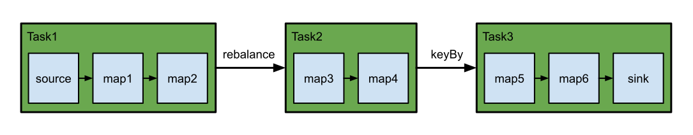

# 执行模式\(批/流\)

DataStream API支持不同的运行时执行模式，您可以根据用例的要求和工作特征从中选择运行模式。

DataStream API有传统的 `STREAMING`执行模式，应用于需要连续增量处理且有望无限期保持在线状态的无界作业。

此外，还有一种称为`BATCH`的 批处理式执行模式。这以一种类似于批处理框架（如MapReduce）的方式执行作业。这应用于具有已知固定输入且不会连续运行的有边界作业。

Apache Flink对流和批处理的统一方法意味着，不管配置的执行模式如何，在有界输入上执行的数据流应用程序将产生相同的最终结果。注意final在这里的意思是很重要的:以流模式执行的作业可能会产生增量更新\(想想数据库中的upserts\)，而批处理作业在最后只会产生一个最终结果。如果正确解释，最终的结果将是相同的，但到达那里的方式可能不同。

通过启用批处理执行，我们允许Flink应用额外的优化，而这些优化只有在知道输入是有限制的情况下才能执行。例如，除了允许更有效的任务调度和故障恢复行为的不同shuffle实现之外，还可以使用不同的连接/聚合策略。我们将在下面研究一些执行行为的细节。

## 什么时候可以/应该使用BATCH执行模式？

批处理执行模式只能用于有界的作业/Flink程序。有界性是数据源的一种属性，它告诉我们来自该数据源的所有输入在执行之前是否已知，或者是否会出现新数据\(可能是无限期的\)。反之，如果作业的所有源都是有界的，那么作业就是有界的，否则就是无界的。

另一方面，流执行模式既可以用于有界作业，也可以用于无界作业

根据经验，当程序是有界的时，使用批处理执行模式更有效。当程序是无界的时，必须使用流执行模式，因为只有这种模式才足以处理连续的数据流。

一个明显的离群值是，当您希望使用有界作业引导某个作业状态，然后希望在无界作业中使用该状态时。例如，通过使用流模式运行一个有界作业，获取一个保存点，然后在一个无界作业上恢复该保存点。这是一个非常具体的用例，当我们允许生成一个保存点作为批处理执行作业的额外输出时，这个用例可能很快就会过时。

使用流模式运行有界作业的另一种情况是为最终将在无界源上运行的代码编写测试。对于测试来说，在这些情况下使用有边界的源更为自然。

## 配置BATCH执行模式

可以通过`execution.runtime-mode`配置设置执行模式。有以下三种模式：

* `STREAMING`：经典的DataStream执行模式（默认）
* `BATCH`：在DataStream API上以批处理方式执行
* `AUTOMATIC`：让系统根据来源的边界来决定

可以通过的命令行参数进行配置`bin/flink run ...`，也可以在创建/配置时以编程方式进行配置`StreamExecutionEnvironment`。

通过命令行配置执行模式的方法如下：

```text
$ bin/flink run -Dexecution.runtime-mode=BATCH examples/streaming/WordCount.jar
```

本示例说明如何在代码中配置执行模式：

```text
StreamExecutionEnvironment env = StreamExecutionEnvironment.getExecutionEnvironment();
env.setRuntimeMode(RuntimeExecutionMode.BATCH);
```


**注意：** 建议用户不要在程序中设置运行时模式，而应在提交应用程序时使用命令行来设置运行时模式。保持应用程序代码的自由配置可提供更大的灵活性，因为可以在任何执行模式下执行同一应用程序。


## 执行行为

本节概述了`BATCH` 执行模式的执行行为，并将其与`STREAMING`执行模式进行了对比。有关更多详细信息，请参阅引入此功能的[FLIP](https://cwiki.apache.org/confluence/x/4i94CQ)： [FLIP-134](https://cwiki.apache.org/confluence/x/4i94CQ)和 [FLIP-140](https://cwiki.apache.org/confluence/x/kDh4CQ)。

### 任务调度和网络Shuffle

Flink作业由在数据流图中连接在一起的不同算子组成。系统决定如何安排在不同进程/机器（TaskManager）上执行这些操作的方式，以及如何在它们之间对数据进行随机（发送）。


另一方面，诸如`keyBy()`或`rebalance()`之类的操作要求在任务的不同并行实例之间对数据进行混洗。这会引起网络混乱。

我们将使用此示例来说明任务调度和网络传输中的差异：

```java
StreamExecutionEnvironment env = StreamExecutionEnvironment.getExecutionEnvironment();

DataStreamSource<String> source = env.fromElements(...);

source.name("source")
	.map(...).name("map1")
	.map(...).name("map2")
	.rebalance()
	.map(...).name("map3")
	.map(...).name("map4")
	.keyBy((value) -> value)
	.map(...).name("map5")
	.map(...).name("map6")
	.sinkTo(...).name("sink");
```


对于上面的示例，Flink将操作分组为如下任务：

* 任务1： `source`，`map1`和`map2`
* 任务2 ：`map3`、`map4`
* 任务3： `map5`，`map6`和`sink`

我们在任务1和2之间以及任务2和3之间进行了网络改组。这是该工作的直观表示：



### 状态后端/状态

### EventTime/Watermarks

### 处理事件

### 故障恢复

## 重要注意事项

与传统的流执行模式相比，在批处理模式下，有些东西可能不能像预期的那样工作。有些特性的工作方式略有不同，而有些特性则不受支持。

批处理模式下的行为改

* “滚动”操作，如reduce\(\)或sum\(\)，会对到达流模式的每个新记录发出增量更新。在批处理模式下，这些操作不会“滚动”。它们只产生最终结果。

批处理模式不支持:

* [检查点](https://ci.apache.org/projects/flink/flink-docs-release-1.12/concepts/stateful-stream-processing.html#stateful-stream-processing)和任何依赖检查点的操作均不起作用。
* [广播状态](https://ci.apache.org/projects/flink/flink-docs-release-1.12/dev/stream/state/broadcast_state.html)
* [迭代次数](https://ci.apache.org/projects/flink/flink-docs-release-1.12/dev/stream/operators/#iterate)

自定义操作符在实现时应该小心谨慎，否则它们可能会行为不当。更多细节请参见下面的其他解释。

### 检查点

正如[上面](https://ci.apache.org/projects/flink/flink-docs-release-1.12/dev/datastream_execution_mode.html#failure-recovery)所解释的，故障恢复的批处理程序不使用检查点。

重要的是要记住，因为没有检查点，某些特性，如CheckpointListener，因此，Kafka的exacly\_once模式或StreamingFileSink的OnCheckpointRollingPolicy将不起作用。如果你需要一个以批处理模式工作的事务接收，请确保它使用[FLIP-143中](https://cwiki.apache.org/confluence/x/KEJ4CQ)建议的Unified Sink API 。

你仍然可以使用所有的状态原语，只是用于故障恢复的机制不同。

### 广播状态

引入这个特性是为了允许用户实现这样的场景:一个“控制”流需要广播到所有下游任务，而广播元素，例如规则，需要应用到来自另一个流的所有传入元素。

在这个模式中，Flink不保证读取输入的顺序。在流媒体世界中，像上面这样的用例是有意义的，因为工作需要在事先不知道的输入数据下运行很长一段时间。在这些设置中，需求可能会随着时间的推移而变化，这取决于传入的数据。

但是，在批处理的世界中，我们相信这样的场景没有多大意义，因为输入\(元素和控制流\)是静态的，并且是预先知道的。

我们计划在批处理中支持这种模式的一种变体，在批处理中，广播端将在将来完全首先处理。

### 编写自定义运算符


**注意：** 自定义运算符是Apache Flink的高级用法模式。对于大多数用例，请考虑改用（keyed）处理函数。


在编写自定义操作符时，一定要记住对批处理执行模式所做的假设。否则，在流模式下工作良好的操作符可能会在批处理模式下产生错误的结果。操作符从来不会局限于特定的键，这意味着它们会看到Flink试图利用的批处理的一些属性。

首先，不应该在操作符中缓存最后看到的Watermarks。在批处理模式下，我们按键处理记录。因此，Watermarks将在每个键之间从MAX\_VALUE切换到MIN\_VALUE。你不应假定Watermarks在操作符中始终是升序的。出于同样的原因，计时器将首先按键顺序触发，然后在每个键中按时间戳顺序触发。此外，不支持手动更改密钥的操作。

