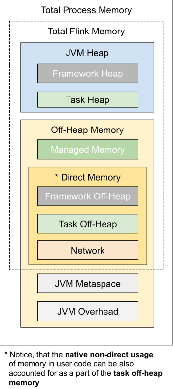

# 内存模型详情

 本节详细介绍了Flink任务执行器的内存模型中的所有组件。检查[内存配置指导](https://ci.apache.org/projects/flink/flink-docs-release-1.10/ops/memory/mem_setup.html)的基本内存设置。

## 总览

下表列出了上面描述的所有内存组件，并引用了影响各个组件大小的Flink配置选项:

|   组件  |   **配置选项**   |   **描述**   |
| :--- | :--- | :--- |
| [框架堆内存](https://ci.apache.org/projects/flink/flink-docs-release-1.10/ops/memory/mem_detail.html#framework-memory) | [`taskmanager.memory.framework.heap.size`](https://ci.apache.org/projects/flink/flink-docs-release-1.10/ops/config.html#taskmanager-memory-framework-heap-size) | 专用于Flink框架的JVM堆内存（高级选项） |
| [任务堆内存](https://ci.apache.org/projects/flink/flink-docs-release-1.10/ops/memory/mem_setup.html#task-operator-heap-memory) | [`taskmanager.memory.task.heap.size`](https://ci.apache.org/projects/flink/flink-docs-release-1.10/ops/config.html#taskmanager-memory-task-heap-size) | 专用于Flink应用程序的JVM堆内存可运行操作员和用户代码 |
| [托管内存](https://ci.apache.org/projects/flink/flink-docs-release-1.10/ops/memory/mem_setup.html#managed-memory) | [`taskmanager.memory.managed.size`](https://ci.apache.org/projects/flink/flink-docs-release-1.10/ops/config.html#taskmanager-memory-managed-size) [`taskmanager.memory.managed.fraction`](https://ci.apache.org/projects/flink/flink-docs-release-1.10/ops/config.html#taskmanager-memory-managed-fraction) | 由Flink管理的本机内存，保留用于排序，哈希表，中间结果的缓存和RocksDB状态后端 |
| [框架堆外内存](https://ci.apache.org/projects/flink/flink-docs-release-1.10/ops/memory/mem_detail.html#framework-memory) | [`taskmanager.memory.framework.off-heap.size`](https://ci.apache.org/projects/flink/flink-docs-release-1.10/ops/config.html#taskmanager-memory-framework-off-heap-size) | 专用于Flink框架[的堆外直接（或本机）内存](https://ci.apache.org/projects/flink/flink-docs-release-1.10/ops/memory/mem_setup.html#configure-off-heap-memory-direct-or-native)（高级选项） |
| [任务堆外内存](https://ci.apache.org/projects/flink/flink-docs-release-1.10/ops/memory/mem_setup.html#configure-off-heap-memory-direct-or-native) | [`taskmanager.memory.task.off-heap.size`](https://ci.apache.org/projects/flink/flink-docs-release-1.10/ops/config.html#taskmanager-memory-task-off-heap-size) | 专用于Flink应用程序以运行操作员[的堆外直接（或本机）内存](https://ci.apache.org/projects/flink/flink-docs-release-1.10/ops/memory/mem_setup.html#configure-off-heap-memory-direct-or-native) |
| 网络内存 | [`taskmanager.memory.network.min`](https://ci.apache.org/projects/flink/flink-docs-release-1.10/ops/config.html#taskmanager-memory-network-min) [`taskmanager.memory.network.max`](https://ci.apache.org/projects/flink/flink-docs-release-1.10/ops/config.html#taskmanager-memory-network-max) [`taskmanager.memory.network.fraction`](https://ci.apache.org/projects/flink/flink-docs-release-1.10/ops/config.html#taskmanager-memory-network-fraction) | 为任务之间的数据记录交换而保留的直接内存\(例如，为通过网络传输而缓冲\)，它是整个Flink内存的一个有上限的细分组件 |
| [JVM元空间](https://ci.apache.org/projects/flink/flink-docs-release-1.10/ops/memory/mem_detail.html#jvm-parameters) | [`taskmanager.memory.jvm-metaspace.size`](https://ci.apache.org/projects/flink/flink-docs-release-1.10/ops/config.html#taskmanager-memory-jvm-metaspace-size) | Flink JVM进程的元空间大小 |
| JVM开销 | [`taskmanager.memory.jvm-overhead.min`](https://ci.apache.org/projects/flink/flink-docs-release-1.10/ops/config.html#taskmanager-memory-jvm-overhead-min) [`taskmanager.memory.jvm-overhead.max`](https://ci.apache.org/projects/flink/flink-docs-release-1.10/ops/config.html#taskmanager-memory-jvm-overhead-max) [`taskmanager.memory.jvm-overhead.fraction`](https://ci.apache.org/projects/flink/flink-docs-release-1.10/ops/config.html#taskmanager-memory-jvm-overhead-fraction) | 为其他JVM开销保留的本机内存:例如线程堆栈、代码缓存、垃圾收集空间等，它是 [总进程内存](https://ci.apache.org/projects/flink/flink-docs-release-1.10/ops/memory/mem_setup.html#configure-total-memory)的一个 [上限细分](https://ci.apache.org/projects/flink/flink-docs-release-1.10/ops/memory/mem_detail.html#capped-fractionated-components)组件 |

如你所见，某些内存组件的大小可以通过相应的选项简单地设置。其他组件可以使用多个选项进行调整。

## 框架内存

如果没有充分的理由，框架堆内存和框架堆外内存选项是不应该更改的。只有当确定Flink需要更多内存来处理某些内部数据结构或操作时，才需要对它们进行调整。它可以与特定的部署环境或作业结构相关，比如高并行性。此外，Flink依赖项\(如Hadoop\)在某些设置中可能消耗更多的直接内存或本机内存。

## 限制分离组件

本节描述以下选项的配置细节，这些选项可能是总内存的一部分:

* _网络内存_可能只占_Flink内存总量的_一小部分
* _JVM开销_可能是_总进程内存的_一小部分

 另请参见[详细的内存模型](https://ci.apache.org/projects/flink/flink-docs-release-1.10/ops/memory/mem_detail.html#overview)。

这些组件的大小必须在其最大值和最小值之间，否则Flink启动将失败。最大值和最小值具有默认值，或者可以通过相应的配置选项显式地设置。例如，如果只设置以下内存选项:

* Flink总内存= 1000Mb，
* 网络最小= 64Mb，
* 网络最大= 128Mb，
* 网络分数= 0.1

那么网络内存将是1000Mb x 0.1 = 100Mb，在64-128Mb范围内。

注意，如果配置相同的最大值和最小值，这实际上意味着它的大小固定在该值上。

如果组件内存没有显式配置，那么Flink将使用分数根据总内存计算内存大小。计算值的上限是对应的最小/最大选项。例如，如果只设置以下内存选项:

* Flink总内存= 1000Mb，
* 网络最小= 128Mb，
* 网络最大= 256Mb，
* 网络分数= 0.1

那么网络内存就会是128Mb，因为分数得出的大小是100Mb，小于最小值。

如果定义了总内存及其其他组件的大小，也可能会忽略该分数。在这种情况下，网络内存是总内存的剩余部分。派生值仍然必须在其最小/最大范围内，否则配置将失败。例如，假设只设置了以下内存选项:

* Flink总内存= 1000Mb，
* 任务堆= 100Mb，
* 网络最小= 64Mb，
* 网络最大= 256Mb，
* 网络分数= 0.1

Flink总内存的所有其他组件都有默认值，包括默认的托管内存分数。那么网络内存不是分数\(1000Mb x 0.1 = 100Mb\)，而是整个Flink内存的其余部分，范围在64-256Mb内，否则将会失败。

## JVM参数

Flink在启动任务执行程序进程时，根据配置的或派生的内存组件大小，显式添加以下与内存相关的JVM参数：

|   **JVM Arguments**   |   **Value**   |
| :--- | :--- |
| _-Xmx_ and _-Xms_ | Framework + Task Heap Memory |
| _-XX:MaxDirectMemorySize_ | Framework + Task Off-Heap + Network Memory |
| _-XX:MaxMetaspaceSize_ | JVM Metaspace |

另请参见[详细的内存模型](https://ci.apache.org/projects/flink/flink-docs-release-1.10/ops/memory/mem_detail.html#overview)。

## 本地执行

|   **Memory component**   |   **Relevant options**   |   **Default value for the local execution**   |
| :--- | :--- | :--- |
| Task heap | [`taskmanager.memory.task.heap.size`](https://ci.apache.org/projects/flink/flink-docs-release-1.10/ops/config.html#taskmanager-memory-task-heap-size) | 无限制 |
| Task off-heap | [`taskmanager.memory.task.off-heap.size`](https://ci.apache.org/projects/flink/flink-docs-release-1.10/ops/config.html#taskmanager-memory-task-off-heap-size) | 无限制 |
| Managed memory | [`taskmanager.memory.managed.size`](https://ci.apache.org/projects/flink/flink-docs-release-1.10/ops/config.html#taskmanager-memory-managed-size) | 128Mb |
| Network memory | [`taskmanager.memory.network.min`](https://ci.apache.org/projects/flink/flink-docs-release-1.10/ops/config.html#taskmanager-memory-network-min) [`taskmanager.memory.network.max`](https://ci.apache.org/projects/flink/flink-docs-release-1.10/ops/config.html#taskmanager-memory-network-max) | 64Mb |

上面列出的所有组件都可以但不需要为本地执行显式配置。如果没有配置它们，则将它们设置为默认值。 [任务堆内存](https://ci.apache.org/projects/flink/flink-docs-release-1.10/ops/memory/mem_setup.html#task-operator-heap-memory)和 _任务堆外内存_被认为是无限的（_Long.MAX\_VALUE_字节），并且[托管内存](https://ci.apache.org/projects/flink/flink-docs-release-1.10/ops/memory/mem_setup.html#managed-memory) 的默认值仅对于本地执行模式为128Mb。


 注意：在这种情况下，任务堆大小与实际堆大小没有任何关系。它可能与后续版本的未来优化相关。启动的本地进程的实际JVM堆大小不受Flink的控制，取决于您如何启动该进程。如果要控制JVM堆大小，则必须显式传递相应的JVM参数，例如_-Xmx_，_-Xms_。


