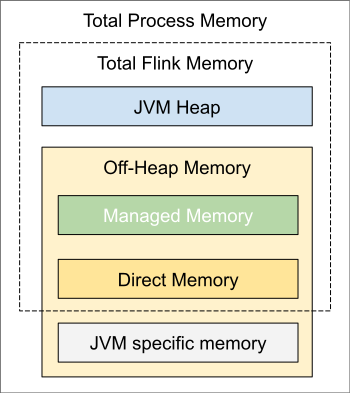

# 设置任务执行器（Task Executor）内存

Apache Flink通过严格控制其各种组件的内存使用情况，在JVM之上提供有效的工作负载。尽管社区努力为所有配置提供合理的默认值，但用户在Flink上部署的应用程序的全部范围意味着这并非总是可能的。为了向我们的用户提供最大的生产价值，Flink允许对群集内的内存分配进行高级和细粒度的调整。

 从_1.10_开始，对内存配置做了进一步描述。如果从早期版本升级Flink，请查看[迁移指南，](https://ci.apache.org/projects/flink/flink-docs-release-1.10/ops/memory/mem_migration.html)因为_1.10_版本引入了许多变更。


此内存设置指南仅适用于任务执行器（Task Executor）!检查 [作业管理器（JobManager）相关的配置选项](https://ci.apache.org/projects/flink/flink-docs-release-1.10/ops/config.html#jobmanager-heap-size)，以获得作业管理器（JobManager）的内存设置。


## 配置总内存

 Flink JVM进程的_总进程内存_由Flink应用程序和运行该进程的JVM _占用的内存_（_总Flink内存_）组成。_Flink内存_的_总_消耗包括JVM堆， _托管内存_（由Flink管理）和其他直接（或本机）内存的使用。

 如果在本地（例如从IDE中）运行Flink而不创建集群，则仅一部分内存配置项是相关的，有关更多详细信息，请参见[本地执行](https://ci.apache.org/projects/flink/flink-docs-release-1.10/ops/memory/mem_detail.html#local-execution)。

否则，在Flink中设置内存最简单的方法是配置以下两个选项之一:

* Flink总内存（[`taskmanager.memory.flink.size`](https://ci.apache.org/projects/flink/flink-docs-release-1.10/ops/config.html#taskmanager-memory-flink-size)）
* 进程总内存（[`taskmanager.memory.process.size`](https://ci.apache.org/projects/flink/flink-docs-release-1.10/ops/config.html#taskmanager-memory-process-size)）

 其余的内存组件将根据默认值或其他配置的选项自动调整。有关其他内存组件的更多详细信息看 [这里](https://ci.apache.org/projects/flink/flink-docs-release-1.10/ops/memory/mem_detail.html)。

配置总Flink内存更适合于独立（standalone）部署，在该部署中您需要声明为Flink本身分配了多少内存。总的Flink内存分为JVM堆、 [托管内存大小](https://ci.apache.org/projects/flink/flink-docs-release-1.10/ops/memory/mem_setup.html#managed-memory)和直接内存。

如果配置总进程内存，则声明应该为Flink JVM进程分配多少内存。对于容器化部署，它对应于请求容器的大小，请参见  [如何为容器](https://ci.apache.org/projects/flink/flink-docs-release-1.10/ops/memory/mem_tuning.html#configure-memory-for-containers) （[Kubernetes](https://ci.apache.org/projects/flink/flink-docs-release-1.10/ops/deployment/kubernetes.html)，[Yarn](https://ci.apache.org/projects/flink/flink-docs-release-1.10/ops/deployment/yarn_setup.html)或[Mesos](https://ci.apache.org/projects/flink/flink-docs-release-1.10/ops/deployment/mesos.html)）[配置内存](https://ci.apache.org/projects/flink/flink-docs-release-1.10/ops/memory/mem_tuning.html#configure-memory-for-containers)。

 设置内存的另一种方法是设置[任务堆](https://ci.apache.org/projects/flink/flink-docs-release-1.10/ops/memory/mem_setup.html#task-operator-heap-memory)和[托管内存](https://ci.apache.org/projects/flink/flink-docs-release-1.10/ops/memory/mem_setup.html#managed-memory) （[`taskmanager.memory.task.heap.size`](https://ci.apache.org/projects/flink/flink-docs-release-1.10/ops/config.html#taskmanager-memory-task-heap-size)和[`taskmanager.memory.managed.size`](https://ci.apache.org/projects/flink/flink-docs-release-1.10/ops/config.html#taskmanager-memory-managed-size)）。[这里](https://ci.apache.org/projects/flink/flink-docs-release-1.10/ops/memory/mem_setup.html#configure-heap-and-managed-memory)将更详细地描述这种更细粒度的方法。


注意：必须使用上面提到的三种方法中的一种来配置Flink的内存\(本地执行除外\)，否则Flink启动将失败。这意味着必须显式地配置下列没有默认值的选项子集之一:


* [`taskmanager.memory.flink.size`](https://ci.apache.org/projects/flink/flink-docs-release-1.10/ops/config.html#taskmanager-memory-flink-size)
* [`taskmanager.memory.process.size`](https://ci.apache.org/projects/flink/flink-docs-release-1.10/ops/config.html#taskmanager-memory-process-size)
* [`taskmanager.memory.task.heap.size`](https://ci.apache.org/projects/flink/flink-docs-release-1.10/ops/config.html#taskmanager-memory-task-heap-size) 和 [`taskmanager.memory.managed.size`](https://ci.apache.org/projects/flink/flink-docs-release-1.10/ops/config.html#taskmanager-memory-managed-size)


注意： 不建议同时配置_总进程内存_和_总Flink内存_。由于潜在的内存配置冲突，可能会导致部署失败。其他内存组件的其他配置也需要谨慎，因为它可能会导致进一步的配置冲突。


## 配置堆和托管内存

### 任务（操作员）堆内存

如果希望确保用户代码有一定数量的JVM堆可用，可以显式地设置任务堆内存\(`taskmanager.memory.task.heap.size`\)。它将被添加到JVM堆大小中，并将专门用于运行用户代码的Flink操作符。

### 托管内存

托管内存由Flink管理，并被分配为本机内存\(堆外\)。以下工作负载使用托管内存:

* 流作业可以将其用于[RocksDB状态后端](https://ci.apache.org/projects/flink/flink-docs-release-1.10/ops/state/state_backends.html#the-rocksdbstatebackend)。
* [批处理作业](https://ci.apache.org/projects/flink/flink-docs-release-1.10/dev/batch)可将其用于排序，哈希表，中间结果的缓存。

 _托管内存_的大小可以是

* 可以通过taskmanager.memory. management .size显式配置
* 或通过taskmanager.memory. management .fraction计算为总Flink内存的一部分。

如果设置了大小\(size\)和分数\(fraction\)，则大小将覆盖分数。如果没有显式配置大小和分数，则使用默认分数。

 另请参阅[如何为状态后端](https://ci.apache.org/projects/flink/flink-docs-release-1.10/ops/memory/mem_tuning.html#configure-memory-for-state-backends)和[批处理作业](https://ci.apache.org/projects/flink/flink-docs-release-1.10/ops/memory/mem_tuning.html#configure-memory-for-batch-jobs)[配置内存](https://ci.apache.org/projects/flink/flink-docs-release-1.10/ops/memory/mem_tuning.html#configure-memory-for-state-backends)。

## 配置堆外内存（直连或本机）

 用户代码分配的堆外内存应在_任务堆外内存_ （[`taskmanager.memory.task.off-heap.size`](https://ci.apache.org/projects/flink/flink-docs-release-1.10/ops/config.html#taskmanager-memory-task-off-heap-size)）中进行处理。


注意：还可以调整框架的堆外内存。这个选项是高级的，只建议在确定Flink框架需要更多内存的情况下更改。


 Flink将框架堆外内存和任务堆外内存包含到JVM的直接内存限制中，另请参见[JVM参数](https://ci.apache.org/projects/flink/flink-docs-release-1.10/ops/memory/mem_detail.html#jvm-parameters)。


注意：尽管本机非直接内存使用可以作为框架堆外内存或任务堆外内存的一部分，但在这种情况下，它会导致更高的JVM直接内存限制。



注意：网络内存也是JVM直接内存的一部分，但它是由Flink管理的，并且保证永远不会超过其配置的大小。因此，在这种情况下，调整网络内存的大小是没有帮助的。


 另请参见[详细的内存模型](https://ci.apache.org/projects/flink/flink-docs-release-1.10/ops/memory/mem_detail.html)。

