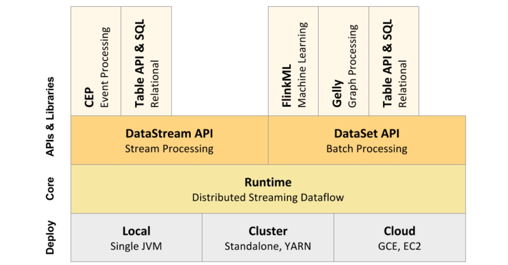

# 组件栈

Flink作为一个软件堆栈，是一个分层系统。堆栈的不同层相互叠加，并提高它们接受的程序表示的抽象级别:

* 运行时层以JobGraph的形式接收程序。JobGraph是一个通用的并行数据流，其中包含使用和生成数据流的任意任务。
* DataStream API和DataSet API都通过单独的编译过程生成JobGraphs。数据集API使用优化器来确定程序的最佳计划，而DataStream API使用流构建器。
* JobGraph是根据Flink中可用的各种部署选项执行的\(例如，本地、远程、Yarn等\)
* Connector层所能对接的技术更是丰富多样，将不同类型、不同来源的数据介入到Flink组件栈中。

  

